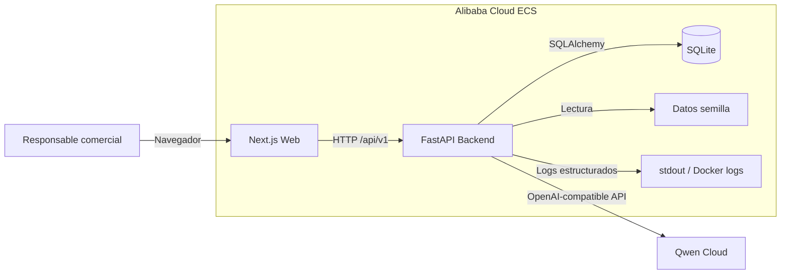
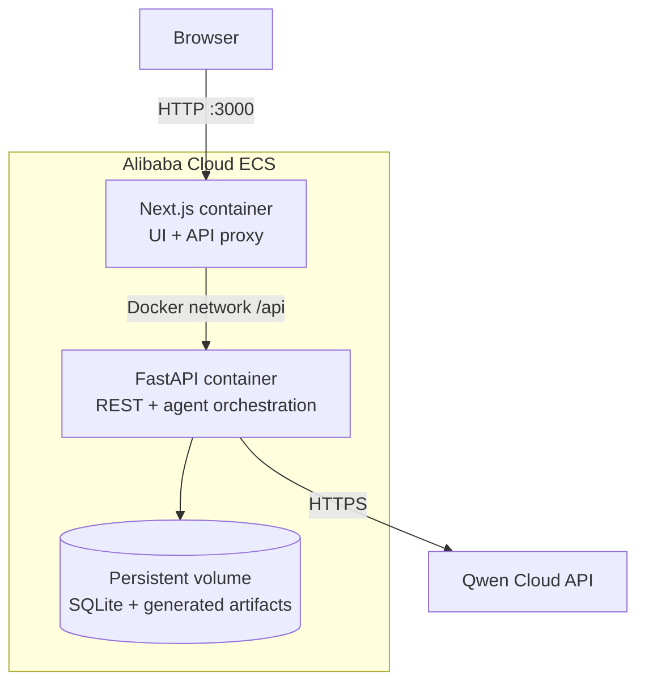
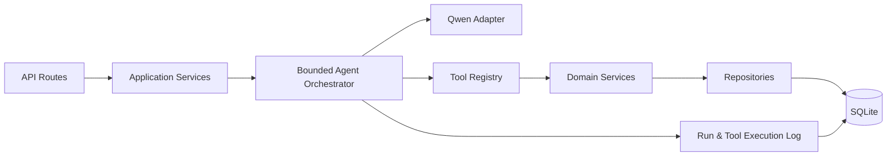
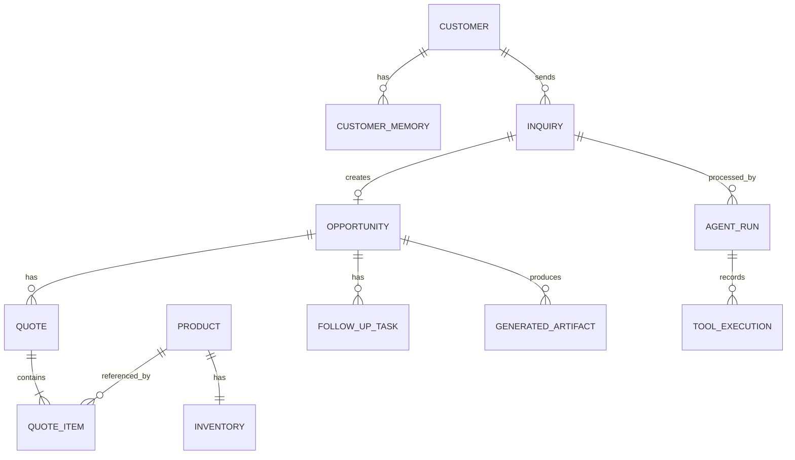
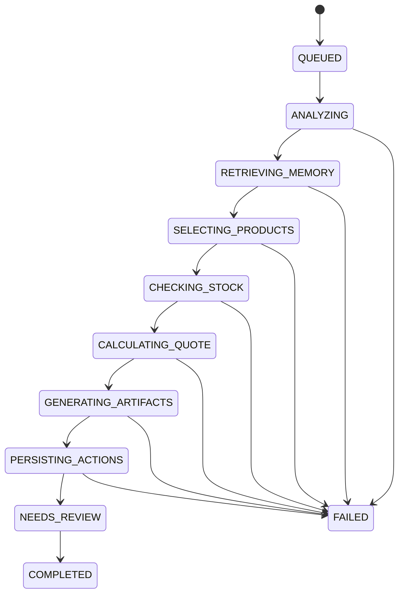
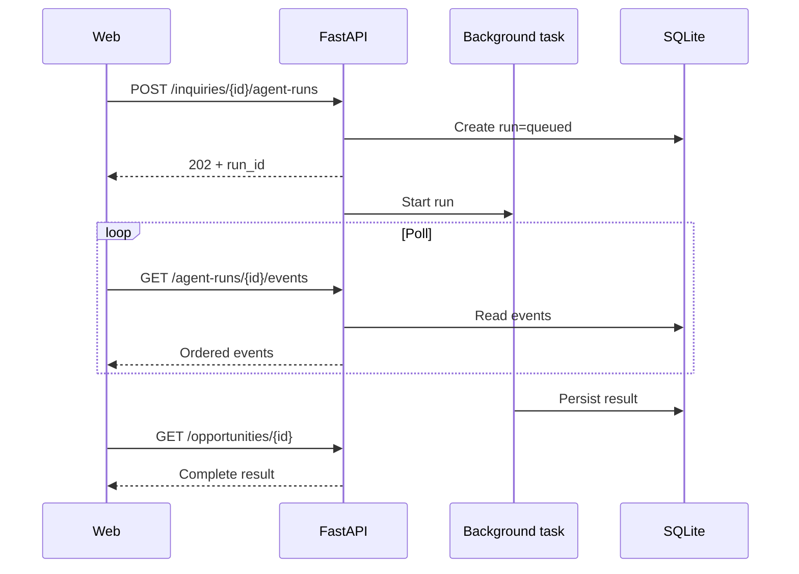
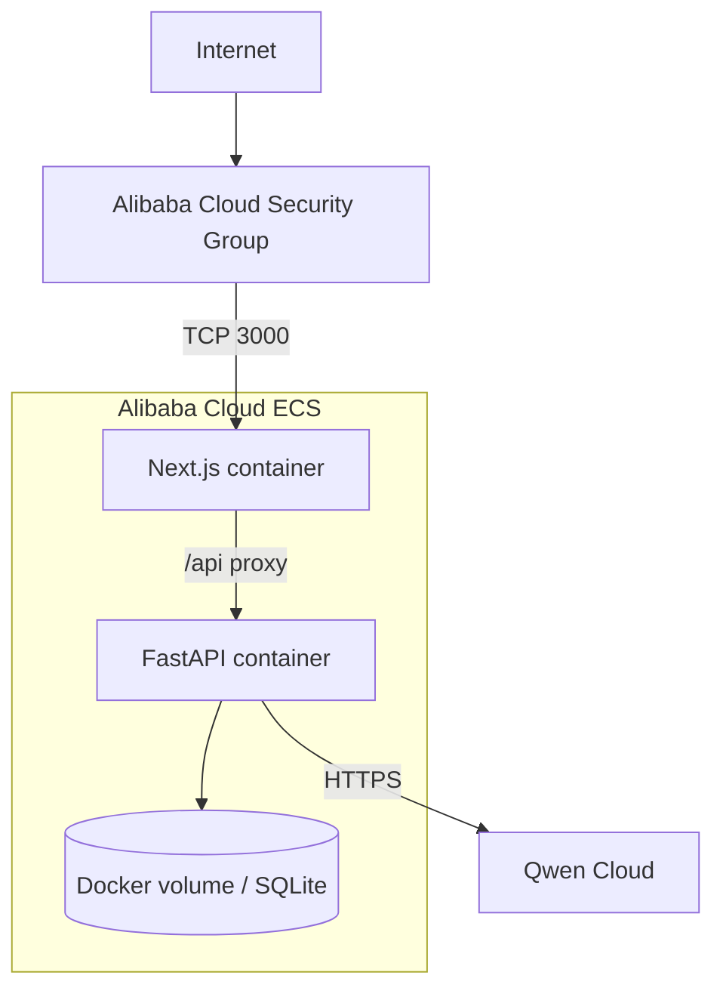

# AdegaFlow AI — Baseline through Sprint 2 Bootstrap


<!-- Source: docs/product/000-sprint-0-charter.md -->

# Sprint 0 — Charter

## Identificación

- **Proyecto:** AdegaFlow AI
- **Sprint:** 0 — Definición
- **Estado:** Completado
- **Fecha de cierre:** 2026-07-10
- **Objetivo único:** cerrar la definición mínima del producto y del MVP antes de tomar decisiones de implementación.

## Resultado esperado

Al finalizar este sprint debe existir una definición suficientemente concreta para que el Sprint 1 pueda diseñar una arquitectura sin inventar requisitos, ampliar el alcance ni depender de interpretaciones ambiguas.

## Entregables

1. Visión del producto.
2. Problema.
3. Usuarios.
4. Propuesta de valor.
5. Alcance del MVP.
6. Exclusiones.
7. Caso de uso principal.
8. Criterios de éxito.
9. Riesgos iniciales.
10. Backlog preliminar.
11. Registro de decisiones, pendientes y supuestos.

## Criterios de aceptación del sprint

- El producto queda definido como un agente comercial autónomo, no como un chatbot.
- Existe un usuario principal claramente priorizado.
- El escenario principal de demostración queda cerrado.
- Las funcionalidades obligatorias del MVP están diferenciadas de las opcionales.
- Las exclusiones protegen el proyecto frente a ampliaciones de alcance.
- Los criterios de éxito son verificables durante la demo.
- Los riesgos tienen mitigaciones iniciales.
- El backlog está priorizado y distribuido por sprints.
- No se ha escrito código.
- Las decisiones arquitectónicas se han reservado para el Sprint 1.

## Definition of Done

El Sprint 0 se considera terminado cuando:

- todos los documentos están versionados en Markdown;
- no existen contradicciones materiales entre ellos;
- cada requisito P0 está vinculado al caso de uso principal;
- las hipótesis están identificadas como tales;
- las decisiones pendientes tienen un momento explícito de resolución;
- el siguiente sprint puede comenzar con un objetivo único y entradas claras.

## Restricciones

- AdegaFlow AI permanece completamente separado de Atlas.
- El MVP se limita al vertical de bodegas gallegas.
- No se desarrollará un ERP, CRM completo ni integración regulatoria real.
- Qwen Cloud debe ser central y visible en el flujo.
- Las acciones con efecto externo permanecerán simuladas o en modo borrador.


---


<!-- Source: docs/product/001-product-vision.md -->

# Visión del producto

## Declaración de visión

**AdegaFlow AI convierte una consulta comercial B2B no estructurada en una oportunidad cualificada, respondida, registrada y preparada para seguimiento mediante un agente especializado en bodegas gallegas.**

## Aspiración

Permitir que una bodega pequeña o mediana atienda oportunidades internacionales con una disciplina comercial comparable a la de una organización mayor, sin implantar un ERP ni ampliar su equipo administrativo.

## Producto que se quiere construir

Una aplicación empresarial ligera que:

- recibe consultas comerciales procedentes de correo, WhatsApp o entrada manual;
- interpreta la intención y extrae datos relevantes;
- recupera contexto previo del comprador;
- consulta catálogo, precios y stock;
- recomienda productos con una justificación trazable;
- prepara una propuesta comercial;
- redacta una respuesta en el idioma adecuado;
- registra una oportunidad en un CRM simulado;
- programa un seguimiento;
- conserva memoria comercial;
- muestra cada acción ejecutada por el agente.

## Producto que no se quiere construir

- un chatbot genérico;
- un CRM completo;
- un ERP;
- una plataforma de comercio exterior;
- un sistema autónomo que envíe comunicaciones o comprometa condiciones comerciales sin revisión humana;
- una plataforma multivertical durante el hackathon.

## Principios de producto

1. **Flujo completo antes que amplitud funcional.** Es preferible ejecutar un caso de uso de principio a fin que mostrar muchas funciones inconexas.
2. **Especialización antes que generalidad.** El contexto de bodegas gallegas debe ser visible en los datos, recomendaciones y narrativa.
3. **Autonomía controlada.** El agente planifica y ejecuta, pero las acciones sensibles quedan en borrador o simulación.
4. **Trazabilidad antes que opacidad.** El usuario debe comprender qué hizo el agente, con qué datos y con qué herramientas.
5. **Realismo antes que espectacularidad.** Los datos pueden ser ficticios, pero deben ser verosímiles y coherentes.
6. **Simplicidad técnica.** No se introduce infraestructura que no aumente directamente la calidad de la demo.
7. **Separación estricta de Atlas.** No se comparte código, repositorio, base de datos, identidad ni decisiones automáticas.

## Resultado de largo plazo

Tras el hackathon, AdegaFlow AI podrá evaluarse como:

- servicio de automatización comercial para bodegas;
- producto SaaS vertical;
- demostrador de consultoría;
- base reutilizable para otros subsectores agroalimentarios.

Esta evolución no forma parte del MVP.


---


<!-- Source: docs/product/002-problem.md -->

# Problema

## Problema principal

Las bodegas pequeñas y medianas suelen gestionar consultas comerciales mediante correo electrónico, WhatsApp, hojas de cálculo y conocimiento informal. El proceso depende de que una persona lea el mensaje, identifique lo importante, consulte varias fuentes, redacte una respuesta, registre la oportunidad y recuerde hacer seguimiento.

El fallo no está únicamente en responder tarde. El problema real es que **la oportunidad comercial no recorre un proceso consistente, trazable y repetible**.

## Situación actual

Una consulta típica de un importador puede contener de forma desordenada:

- país de destino;
- volumen;
- tipo de vino;
- presupuesto;
- canal de venta;
- plazo;
- solicitud de muestras;
- requisitos documentales;
- condiciones de entrega;
- idioma preferido.

Para responder correctamente, el responsable comercial debe combinar información de varias fuentes y tomar decisiones que rara vez quedan registradas de forma estructurada.

## Causas raíz

1. Información distribuida en diferentes canales y documentos.
2. Catálogo, stock y condiciones comerciales sin una interfaz unificada.
3. Ausencia de un proceso estándar de cualificación.
4. Seguimiento dependiente de memoria personal.
5. Conocimiento comercial concentrado en pocas personas.
6. Herramientas existentes demasiado genéricas o complejas para el tamaño de la empresa.
7. Barreras de idioma y contexto en oportunidades internacionales.

## Consecuencias

- respuestas tardías;
- pérdida de oportunidades;
- ofertas inconsistentes;
- recomendaciones de productos no disponibles;
- ausencia de seguimiento;
- duplicación de trabajo;
- baja trazabilidad;
- dependencia de personas clave;
- dificultad para escalar la actividad internacional;
- mayor carga administrativa.

## Trabajo que el usuario necesita completar

> Cuando llega una consulta comercial, necesito convertirla rápidamente en una oportunidad bien entendida, con una respuesta coherente, productos disponibles, registro y seguimiento, sin revisar manualmente múltiples fuentes ni depender de mi memoria.

## Alternativas actuales

| Alternativa | Ventaja | Limitación |
|---|---|---|
| Correo + hoja de cálculo | Bajo coste y familiaridad | Proceso manual, fragmentado y poco trazable |
| CRM genérico | Registro estructurado | Requiere carga manual y no razona sobre catálogo o stock |
| Chatbot genérico | Responde preguntas | No ejecuta el flujo empresarial completo |
| ERP | Centraliza operaciones | Excesivo para el alcance, coste y tiempo del MVP |
| Automatizaciones rígidas | Repetibles | Fallan ante mensajes ambiguos o datos incompletos |

## Oportunidad

Un agente especializado puede conectar interpretación, datos y acciones en un único flujo controlado. El valor no reside en generar texto, sino en **transformar una entrada no estructurada en trabajo comercial ejecutado y verificable**.


---


<!-- Source: docs/product/003-users.md -->

# Usuarios

## Usuario principal

### Responsable comercial o de exportación de una bodega gallega pequeña o mediana

#### Responsabilidades

- recibir y responder consultas;
- recomendar referencias;
- validar precios y disponibilidad;
- coordinar muestras;
- registrar oportunidades;
- realizar seguimiento;
- mantener relaciones con distribuidores e importadores.

#### Objetivos

- responder con rapidez;
- no perder oportunidades;
- mantener consistencia comercial;
- priorizar oportunidades con mayor potencial;
- reducir tareas administrativas;
- atender mercados internacionales sin aumentar proporcionalmente el equipo.

#### Fricciones

- mensajes incompletos;
- información distribuida;
- consultas repetitivas;
- dificultad para recordar interacciones previas;
- stock cambiante;
- traducción y adaptación de tono;
- falta de disciplina de seguimiento.

#### Necesidad crítica

Disponer de una vista única donde pueda revisar el mensaje original, los datos extraídos, la recomendación, la propuesta, el borrador de respuesta y las acciones ejecutadas.

## Usuarios secundarios internos

### Gerente o propietario

Necesita visibilidad sobre oportunidades, actividad comercial y capacidad de respuesta, sin participar en cada operación.

### Administración u operaciones

Necesita confirmar stock, preparar muestras, coordinar tareas y evitar compromisos que no puedan cumplirse.

### Responsable de producto o enología

Puede validar información técnica, notas de cata, certificaciones y adecuación de referencias.

## Actor externo

### Importador o distribuidor

No opera directamente la aplicación en el MVP. Es el originador de la consulta y receptor potencial de la propuesta.

Sus expectativas son:

- respuesta clara;
- información coherente;
- productos adecuados a su mercado;
- disponibilidad;
- próximos pasos;
- comunicación en un idioma apropiado.

## Priorización

| Actor | Prioridad en el MVP | Motivo |
|---|---:|---|
| Responsable comercial/exportación | P0 | Opera el flujo principal |
| Gerente/propietario | P1 | Consume resultados y métricas |
| Operaciones/administración | P1 | Recibe tareas derivadas |
| Importador/distribuidor | P0 como actor externo | Origina el caso de uso |
| Otros sectores agroalimentarios | Fuera de alcance | Dispersan el foco vertical |

## Decisión de diseño de producto

La interfaz se optimizará para el responsable comercial. No se diseñarán portales separados para cada actor durante el hackathon.


---


<!-- Source: docs/product/004-value-proposition.md -->

# Propuesta de valor

## Propuesta principal

Para bodegas gallegas pequeñas y medianas que gestionan consultas B2B de forma manual, **AdegaFlow AI es un agente comercial autónomo que transforma mensajes no estructurados en oportunidades cualificadas, propuestas coherentes y seguimientos registrados**, utilizando catálogo, stock, memoria y herramientas empresariales en un flujo trazable.

## Beneficios funcionales

- extracción automática de información comercial;
- detección de datos faltantes;
- consulta de catálogo y stock;
- recomendación contextual de productos;
- generación de propuesta;
- redacción multilingüe;
- registro automático de oportunidad;
- creación de seguimiento;
- memoria de preferencias del comprador;
- historial de acciones y herramientas.

## Beneficios operativos

- menor tiempo de respuesta;
- menos pasos manuales;
- menor dependencia de memoria individual;
- mayor consistencia en ofertas;
- mejor disciplina de seguimiento;
- centralización de contexto;
- reducción de errores por disponibilidad o datos incompletos.

Las mejoras cuantitativas deberán validarse posteriormente. Durante la demo se mostrarán como estimaciones o simulaciones, nunca como resultados reales obtenidos en clientes.

## Diferenciación

### Frente a un chatbot

AdegaFlow AI no se limita a conversar. Planifica, consulta fuentes, ejecuta herramientas, genera artefactos y registra acciones.

### Frente a un CRM

No exige que el usuario estructure manualmente toda la oportunidad. Interpreta la consulta y crea el registro.

### Frente a una automatización rígida

Puede trabajar con mensajes incompletos, identificar ambigüedades y decidir el siguiente paso.

### Frente a una solución horizontal

Utiliza catálogo, stock, lenguaje y escenarios propios del negocio vitivinícola gallego.

## Mensaje central para la demo

> De una consulta en inglés a una oportunidad cualificada, una propuesta comercial y un seguimiento programado en un único flujo trazable.

## Promesa controlada

El sistema prepara y organiza el trabajo comercial. No sustituye la validación humana de precios, condiciones contractuales, logística, aduanas o compromisos definitivos.


---


<!-- Source: docs/product/005-mvp-scope.md -->

# Alcance del MVP

## Objetivo del MVP

Demostrar que AdegaFlow AI puede procesar de principio a fin una consulta comercial B2B para una bodega gallega mediante Qwen Cloud y herramientas estructuradas.

## Alcance funcional obligatorio — P0

### Acceso y entrada

- acceso demo sin sistema completo de cuentas;
- bandeja simple de consultas;
- entrada manual de un mensaje comercial;
- carga de un escenario predefinido.

### Comprensión

- detección de idioma;
- clasificación de intención;
- identificación de oportunidad B2B;
- extracción estructurada de:
  - empresa o comprador;
  - país o mercado;
  - tipo de producto;
  - volumen;
  - canal;
  - fecha objetivo;
  - presupuesto, cuando exista;
  - solicitud de muestras;
  - requisitos mencionados;
- identificación explícita de datos faltantes;
- asignación de prioridad con una justificación simple.

### Contexto y memoria

- recuperación de historial del comprador;
- uso de preferencias previas en la recomendación;
- persistencia de nueva memoria comercial;
- visualización del contexto recuperado y guardado.

### Herramientas empresariales simuladas

- búsqueda de catálogo;
- consulta de stock;
- detalle de producto;
- cálculo básico de propuesta;
- creación de oportunidad en CRM simulado;
- creación de tarea de seguimiento;
- generación de propuesta;
- creación de borrador de correo.

### Resultado comercial

- recomendación de al menos dos productos adecuados;
- propuesta con cantidades, precios de demostración y condiciones identificadas como preliminares;
- borrador de respuesta en el idioma apropiado;
- registro de la oportunidad;
- seguimiento programado;
- historial de acciones ejecutadas.

### Trazabilidad

- secuencia visible de pasos;
- herramientas invocadas;
- entradas y salidas resumidas;
- estado de cada acción;
- errores controlados;
- indicación de qué elementos requieren revisión humana.

### IA

- Qwen Cloud debe intervenir de forma central en:
  - interpretación;
  - planificación o selección de herramientas;
  - generación estructurada;
  - redacción de la respuesta.

## Datos de demostración

- una bodega ficticia;
- catálogo inicial de seis tipos de producto;
- stock coherente con el catálogo;
- varios compradores ficticios;
- historial y preferencias;
- oportunidades y seguimientos simulados;
- precios identificados como datos de demostración.

## Alcance no funcional

- ejecución reproducible mediante Docker;
- configuración por variables de entorno;
- ausencia de secretos en repositorio;
- validación de entradas y salidas;
- logs suficientes para diagnosticar la demo;
- pruebas del flujo crítico;
- interfaz responsive;
- degradación controlada ante errores del modelo o de una herramienta.

## Decisiones de alcance

1. Se usará **acceso demo**, no autenticación completa.
2. Se mostrará **una sola organización ficticia**, no multitenencia.
3. Las comunicaciones permanecerán en **modo borrador**.
4. El CRM, stock y seguimiento serán **simulados pero persistentes**.
5. La demo priorizará un flujo robusto sobre múltiples escenarios.


---


<!-- Source: docs/product/006-exclusions.md -->

# Exclusiones

## Fuera del MVP del hackathon

### Sistemas empresariales completos

- ERP;
- CRM generalista;
- sistema de gestión de inventario completo;
- facturación;
- contabilidad;
- pagos;
- portal de clientes;
- gestión integral de pedidos.

### Integraciones reales

- envío real de correo o WhatsApp;
- integración con CRM externo;
- integración con ERP;
- actualización real de stock;
- calendarios externos;
- aduanas;
- EMCS, DUA u organismos públicos;
- operadores logísticos;
- firma digital.

### Funciones regulatorias o legales

- asesoramiento legal;
- validación aduanera definitiva;
- recomendación vinculante de Incoterms;
- cálculo fiscal;
- verificación automática de cumplimiento normativo;
- compromisos contractuales automáticos.

### Plataforma y seguridad avanzada

- multitenencia;
- roles y permisos complejos;
- SSO;
- auditoría empresarial completa;
- alta disponibilidad;
- escalado horizontal;
- colas distribuidas;
- Kubernetes;
- microservicios independientes.

### IA y datos avanzados

- entrenamiento o fine-tuning propio;
- agentes físicamente separados sin necesidad demostrada;
- RAG sobre grandes repositorios documentales;
- predicción avanzada de demanda;
- scoring financiero;
- análisis crediticio;
- optimización logística;
- autonomía sin revisión humana.

### Expansión comercial

- conserveras;
- queserías;
- cooperativas;
- múltiples denominaciones y verticales completos;
- marketplace;
- SaaS comercial listo para producción.

## Regla para nuevas ideas

Toda idea nueva se registra en el backlog. Solo puede entrar en el sprint activo si:

1. elimina un bloqueo crítico;
2. mejora directamente el flujo principal;
3. no compromete plazo, estabilidad ni claridad de la demo;
4. se documenta la decisión.

## Criterio de rechazo

Una funcionalidad se excluye cuando su coste de construcción, prueba o explicación supera el valor demostrable que aporta al escenario principal.


---


<!-- Source: docs/product/007-primary-use-case.md -->

# Caso de uso principal

## UC-001 — Gestionar una consulta de un importador alemán

### Objetivo

Transformar una consulta comercial en inglés en una oportunidad B2B cualificada, una recomendación de productos, una propuesta, un borrador de respuesta, un registro CRM y una tarea de seguimiento.

### Actor principal

Responsable comercial o de exportación de la bodega.

### Actor externo

Importador o distribuidor alemán.

### Disparador

El responsable comercial recibe o introduce el siguiente tipo de mensaje:

> A German distributor is evaluating Galician Albariño for specialised wine shops. They estimate an initial order of 600 bottles within 60 days and request a price list and samples.

### Datos conocidos

- mercado: Alemania;
- volumen estimado: 600 botellas;
- interés: Albariño;
- canal: tiendas especializadas;
- fecha objetivo: 60 días;
- solicitud: lista de precios y muestras;
- idioma: inglés.

### Datos potencialmente faltantes

- presupuesto;
- ciudad o región de distribución;
- formato de cajas;
- dirección para muestras;
- condiciones de entrega;
- certificaciones requeridas;
- datos fiscales;
- fecha exacta de decisión.

### Precondiciones

- catálogo de demostración cargado;
- stock disponible;
- comprador existente o identificable;
- herramientas simuladas operativas;
- Qwen Cloud configurado;
- usuario en modo demo.

## Flujo principal

1. El usuario abre la consulta.
2. El sistema conserva y muestra el mensaje original.
3. Qwen Cloud detecta idioma, intención y tipo de oportunidad.
4. El agente extrae los datos estructurados.
5. El agente identifica la información faltante.
6. El agente recupera el historial del comprador.
7. El agente consulta el catálogo.
8. El agente consulta stock de los productos candidatos.
9. El agente selecciona dos referencias compatibles con mercado, canal, volumen y disponibilidad.
10. El agente genera una justificación comercial.
11. El agente calcula una propuesta preliminar.
12. El agente genera un documento o vista de propuesta.
13. El agente redacta una respuesta en inglés.
14. El agente crea una oportunidad en el CRM simulado.
15. El agente crea una tarea de seguimiento para siete días después.
16. El agente guarda las preferencias detectadas.
17. La interfaz muestra el resultado y la trazabilidad completa.
18. El usuario revisa y aprueba conceptualmente el borrador; no se envía nada.

## Resultado esperado

- oportunidad clasificada como B2B internacional;
- prioridad asignada;
- dos productos recomendados y disponibles;
- propuesta coherente con 600 botellas;
- borrador en inglés;
- oportunidad registrada;
- seguimiento a siete días;
- memoria actualizada;
- acciones visibles.

## Flujos alternativos

### A1 — Stock insuficiente

El agente no recomienda un producto sin disponibilidad. Propone una combinación alternativa, reduce la cantidad o marca la necesidad de validación.

### A2 — Comprador desconocido

El agente crea un perfil básico con la información disponible y señala los datos pendientes.

### A3 — Datos insuficientes para cotizar

El agente genera una respuesta de clarificación y registra la oportunidad sin inventar precios ni condiciones.

### A4 — Error de una herramienta

La acción queda marcada como fallida, el flujo no oculta el error y el usuario recibe una recomendación de recuperación.

### A5 — Salida inválida del modelo

El backend valida la estructura, solicita una corrección controlada o aplica una ruta de fallback.

## Reglas de negocio iniciales

- no recomendar productos sin stock confirmado;
- no inventar certificaciones;
- los precios son preliminares y de demostración;
- las condiciones logísticas requieren validación humana;
- la comunicación no se envía automáticamente;
- el seguimiento estándar del escenario es de siete días;
- toda acción debe quedar registrada.

## Criterios de aceptación

- el flujo se completa desde el mensaje hasta el seguimiento;
- se utilizan al menos tres herramientas;
- la recomendación solo incluye productos válidos;
- los campos extraídos son visibles y editables en una fase posterior;
- la respuesta está en inglés;
- no existe ninguna acción externa irreversible.


---


<!-- Source: docs/product/008-success-criteria.md -->

# Criterios de éxito

## Éxito funcional del MVP

El MVP se considera funcionalmente exitoso cuando cumple todos los criterios P0:

| ID | Criterio | Verificación |
|---|---|---|
| SC-001 | Recibe una consulta comercial no estructurada | Entrada manual o escenario demo |
| SC-002 | Detecta una oportunidad B2B internacional | Clasificación visible |
| SC-003 | Extrae los datos principales | Resultado estructurado validado |
| SC-004 | Identifica información faltante | Lista explícita, sin inventar datos |
| SC-005 | Recupera memoria del comprador | Historial mostrado |
| SC-006 | Invoca al menos tres herramientas | Registro de ejecuciones |
| SC-007 | Consulta catálogo y stock | Resultados trazables |
| SC-008 | Recomienda productos disponibles | Validación contra datos semilla |
| SC-009 | Genera una propuesta coherente | Cantidades y precios consistentes |
| SC-010 | Redacta respuesta en el idioma adecuado | Borrador en inglés |
| SC-011 | Registra la oportunidad | Registro persistente en CRM simulado |
| SC-012 | Crea seguimiento a siete días | Tarea persistente |
| SC-013 | Guarda memoria comercial | Preferencias recuperables |
| SC-014 | Muestra el historial de acciones | Línea de tiempo o panel |
| SC-015 | Utiliza Qwen Cloud de forma central | Evidencia en ejecución y documentación |
| SC-016 | Completa el flujo de demo sin acciones externas | Revisión manual final |

## Calidad mínima de la demo

- el escenario principal puede repetirse;
- los datos resultantes son coherentes entre pantallas;
- los errores no exponen trazas sensibles;
- las claves permanecen fuera del repositorio;
- el flujo crítico cuenta con pruebas;
- la aplicación puede levantarse mediante instrucciones documentadas;
- la interfaz permite comprender qué hizo el agente en menos de dos minutos;
- la demostración no depende de editar código en directo.

## Criterios narrativos

La demo debe dejar claro que:

1. el problema es comercial y operativo, no meramente conversacional;
2. la especialización en bodegas aporta contexto;
3. Qwen Cloud interpreta y coordina acciones;
4. las herramientas ejecutan trabajo empresarial;
5. la memoria mejora la continuidad;
6. la trazabilidad permite supervisión humana;
7. el producto puede evolucionar hacia una oferta comercial.

## Umbrales internos de preparación

Antes de grabar o presentar:

- 10 ejecuciones consecutivas del escenario principal sin fallo bloqueante;
- 100 % de las recomendaciones consistentes con el stock;
- 0 secretos detectados en el repositorio;
- 0 enlaces o botones que prometan acciones reales no implementadas;
- 1 ruta de fallback probada para fallo del modelo;
- 1 ruta de fallback probada para fallo de una herramienta.

Estos umbrales son objetivos internos del proyecto, no métricas oficiales del hackathon.

## No se considerará éxito

- una demo basada únicamente en texto generado;
- un flujo con resultados hardcodeados que no use Qwen Cloud;
- una interfaz atractiva sin ejecución real de herramientas;
- una arquitectura compleja que no complete el caso de uso;
- una propuesta que dependa de integraciones externas no controladas.


---


<!-- Source: docs/product/009-initial-risks.md -->

# Riesgos iniciales

## Escala

- **Probabilidad:** Baja / Media / Alta
- **Impacto:** Bajo / Medio / Alto / Crítico

| ID | Riesgo | Prob. | Impacto | Mitigación inicial | Indicador |
|---|---|---:|---:|---|---|
| R-001 | Ampliación continua del alcance | Alta | Crítico | Congelar P0, registrar ideas en backlog y exigir decisión documentada | Nuevas funciones dentro del sprint activo |
| R-002 | Tool calling de Qwen Cloud menos estable de lo esperado | Media | Crítico | Probar un spike temprano, validar esquemas y diseñar fallback | Respuestas no estructuradas o llamadas omitidas |
| R-003 | Salidas del modelo no válidas | Alta | Alto | Pydantic/JSON Schema, reintento controlado y validación determinista | Errores frecuentes de parsing |
| R-004 | Latencia excesiva durante la demo | Media | Alto | Reducir rondas del agente, limitar contexto y precargar datos | Flujo tarda demasiado o parece detenido |
| R-005 | Dependencia de conectividad o API externa | Media | Crítico | Escenario de respaldo, manejo visible de error y demo grabada | Fallos de red o límites de API |
| R-006 | Recomendaciones con stock o precios incoherentes | Media | Crítico | Tools como fuente de verdad; prohibir inventar datos | Discrepancias entre propuesta y catálogo |
| R-007 | Datos de demostración poco creíbles | Media | Alto | Catálogo y compradores coherentes, revisión sectorial posterior | Productos o condiciones genéricas |
| R-008 | El proyecto parece un chatbot | Media | Crítico | UX basada en flujo, herramientas, artefactos y trazabilidad | Demo centrada en una ventana de chat |
| R-009 | Sobreingeniería multiagente | Alta | Alto | Un orquestador con capacidades lógicas salvo necesidad probada | Múltiples servicios sin valor demostrable |
| R-010 | Interfaz consume tiempo del núcleo funcional | Media | Alto | Implementar primero flujo y contratos; UI después | Pantallas avanzadas sin backend estable |
| R-011 | Falta de claridad sobre criterios oficiales del hackathon | Media | Alto | Validar reglas y categorías antes de cerrar Sprint 1 | Narrativa o entrega no alineada |
| R-012 | Mensajes multilingües generan errores de tono o contenido | Media | Medio | Plantillas, pruebas y revisión del borrador | Respuestas correctas semánticamente pero impropias |
| R-013 | Confusión entre datos simulados y hechos reales | Media | Alto | Etiquetas visibles y documentación explícita | Métricas o precios presentados como reales |
| R-014 | Exposición de claves API | Baja | Crítico | Variables de entorno, `.env.example`, secret scanning | Claves en commits o logs |
| R-015 | Ausencia de validación con usuarios del sector | Alta | Alto | Entrevista breve con 1–3 profesionales tras la demo base | Supuestos de proceso no confirmados |
| R-016 | Mezcla accidental con Atlas | Baja | Alto | Repositorio, nombres y documentación separados | Referencias, código o dependencias compartidas |
| R-017 | Preparación tardía de video y submission | Media | Alto | Reservar Sprint 4 y congelar funciones antes | Cambios funcionales durante grabación |
| R-018 | Promesas regulatorias o logísticas excesivas | Media | Alto | Human-in-the-loop y disclaimers | Recomendaciones presentadas como definitivas |

## Riesgos prioritarios del Sprint 1

1. R-002 — compatibilidad real de Qwen Cloud con el patrón de tool calling elegido.
2. R-003 — confiabilidad de salidas estructuradas.
3. R-009 — evitar una arquitectura multiagente innecesaria.
4. R-011 — validar reglas y categoría oficial del hackathon.
5. R-006 — definir una única fuente de verdad para catálogo, stock y precios.

## Regla de gestión

Un riesgo pasa a bloqueo cuando amenaza la ejecución completa del caso de uso principal. Los bloqueos se resuelven antes de añadir funciones P1.


---


<!-- Source: docs/product/010-preliminary-backlog.md -->

# Backlog preliminar

## Convenciones

- **P0:** imprescindible para la demo.
- **P1:** importante si no compromete P0.
- **P2:** posterior al hackathon.
- **SP:** estimación preliminar relativa; debe revisarse tras la arquitectura.

## Epic E0 — Gobierno y definición

| ID | Historia / tarea | Pri. | SP | Sprint |
|---|---|---:|---:|---:|
| AF-001 | Aprobar visión, problema y usuario principal | P0 | 1 | 0 |
| AF-002 | Congelar alcance y exclusiones del MVP | P0 | 1 | 0 |
| AF-003 | Definir caso de uso principal | P0 | 1 | 0 |
| AF-004 | Definir criterios de éxito y riesgos | P0 | 1 | 0 |
| AF-005 | Validar reglas y categoría oficial del hackathon | P0 | 2 | 1 |

## Epic E1 — Arquitectura y contratos

| ID | Historia / tarea | Pri. | SP | Sprint |
|---|---|---:|---:|---:|
| AF-010 | Diseñar arquitectura de contexto y contenedores | P0 | 3 | 1 |
| AF-011 | Definir estructura final del repositorio | P0 | 2 | 1 |
| AF-012 | Definir modelo de datos mínimo | P0 | 3 | 1 |
| AF-013 | Definir contratos API del flujo principal | P0 | 3 | 1 |
| AF-014 | Definir esquemas de entrada/salida de tools | P0 | 3 | 1 |
| AF-015 | Definir estrategia de orquestación | P0 | 3 | 1 |
| AF-016 | Definir estrategia de memoria | P0 | 2 | 1 |
| AF-017 | Definir estrategia de prompts y versionado | P0 | 2 | 1 |
| AF-018 | Redactar ADR-001 a ADR-010 | P0 | 5 | 1 |
| AF-019 | Ejecutar spike de Qwen Cloud y tool calling | P0 | 5 | 1 |

## Epic E2 — Datos de demostración

| ID | Historia / tarea | Pri. | SP | Sprint |
|---|---|---:|---:|---:|
| AF-020 | Crear catálogo ficticio verosímil | P0 | 3 | 2 |
| AF-021 | Crear stock y reglas de disponibilidad | P0 | 2 | 2 |
| AF-022 | Crear compradores e historial | P0 | 2 | 2 |
| AF-023 | Crear escenarios de demo y prueba | P0 | 3 | 2 |
| AF-024 | Validar consistencia entre catálogo, stock y precios | P0 | 2 | 2 |

## Epic E3 — Núcleo del agente

| ID | Historia / tarea | Pri. | SP | Sprint |
|---|---|---:|---:|---:|
| AF-030 | Integrar Qwen Cloud | P0 | 5 | 2 |
| AF-031 | Implementar extracción estructurada | P0 | 5 | 2 |
| AF-032 | Implementar clasificación y prioridad | P0 | 3 | 2 |
| AF-033 | Implementar orquestador del flujo | P0 | 8 | 2 |
| AF-034 | Implementar validación y reintentos | P0 | 5 | 2 |
| AF-035 | Implementar registro de ejecución | P0 | 3 | 2 |
| AF-036 | Implementar fallback del modelo | P0 | 3 | 2 |

## Epic E4 — Herramientas

| ID | Historia / tarea | Pri. | SP | Sprint |
|---|---|---:|---:|---:|
| AF-040 | Implementar `search_catalog` | P0 | 3 | 2 |
| AF-041 | Implementar `check_stock` | P0 | 3 | 2 |
| AF-042 | Implementar `get_product_details` | P0 | 2 | 2 |
| AF-043 | Implementar `calculate_quote` | P0 | 5 | 2 |
| AF-044 | Implementar `retrieve_customer_history` | P0 | 3 | 2 |
| AF-045 | Implementar `save_customer_memory` | P0 | 3 | 2 |
| AF-046 | Implementar `create_crm_opportunity` | P0 | 3 | 2 |
| AF-047 | Implementar `create_followup_task` | P0 | 2 | 2 |
| AF-048 | Implementar `generate_proposal` | P0 | 3 | 2 |
| AF-049 | Implementar `draft_email` | P0 | 3 | 2 |
| AF-050 | Implementar `translate_message` solo si es necesario | P1 | 2 | 2 |

## Epic E5 — Aplicación web

| ID | Historia / tarea | Pri. | SP | Sprint |
|---|---|---:|---:|---:|
| AF-060 | Crear acceso demo | P0 | 2 | 3 |
| AF-061 | Crear bandeja de consultas | P0 | 3 | 3 |
| AF-062 | Crear entrada manual y escenario predefinido | P0 | 3 | 3 |
| AF-063 | Mostrar mensaje y datos extraídos | P0 | 3 | 3 |
| AF-064 | Mostrar clasificación y datos faltantes | P0 | 2 | 3 |
| AF-065 | Mostrar herramientas y línea de tiempo | P0 | 5 | 3 |
| AF-066 | Mostrar recomendaciones y stock | P0 | 3 | 3 |
| AF-067 | Mostrar propuesta y borrador | P0 | 5 | 3 |
| AF-068 | Mostrar registro CRM y seguimiento | P0 | 3 | 3 |
| AF-069 | Mostrar memoria recuperada y guardada | P0 | 3 | 3 |
| AF-070 | Añadir panel de métricas simuladas | P1 | 3 | 3 |
| AF-071 | Exportar propuesta a PDF | P1 | 5 | 3 |

## Epic E6 — Calidad, seguridad y entrega

| ID | Historia / tarea | Pri. | SP | Sprint |
|---|---|---:|---:|---:|
| AF-080 | Pruebas unitarias de tools | P0 | 5 | 2–3 |
| AF-081 | Prueba end-to-end del escenario principal | P0 | 5 | 3 |
| AF-082 | Pruebas de fallos de modelo y tools | P0 | 3 | 3 |
| AF-083 | Configurar Docker y Docker Compose | P0 | 3 | 3 |
| AF-084 | Configurar variables de entorno y secret scanning | P0 | 2 | 3 |
| AF-085 | Preparar README reproducible | P0 | 3 | 4 |
| AF-086 | Preparar guion de demo | P0 | 3 | 4 |
| AF-087 | Grabar video | P0 | 5 | 4 |
| AF-088 | Preparar presentación y capturas | P0 | 3 | 4 |
| AF-089 | Completar submission | P0 | 3 | 4 |

## Epic E7 — Post-hackathon

| ID | Historia / tarea | Pri. | SP | Sprint |
|---|---|---:|---:|---:|
| AF-100 | Validar con bodegas reales | P2 | — | Futuro |
| AF-101 | Diseñar multitenencia | P2 | — | Futuro |
| AF-102 | Integrar CRM real | P2 | — | Futuro |
| AF-103 | Integrar correo real con aprobación | P2 | — | Futuro |
| AF-104 | Evaluar SaaS y modelo comercial | P2 | — | Futuro |
| AF-105 | Evaluar adaptación a otros subsectores | P2 | — | Futuro |

## Orden de ejecución recomendado

1. Validar hackathon y Qwen Cloud.
2. Cerrar arquitectura y contratos.
3. Construir datos y tools.
4. Completar el flujo backend.
5. Probar el flujo.
6. Construir la interfaz.
7. Congelar funciones.
8. Preparar demo y submission.

## Política de backlog

Los elementos P1 no comienzan hasta que el escenario principal cumpla todos los criterios P0.


---


<!-- Source: docs/product/011-sprint-0-closure.md -->

# Cierre del Sprint 0

## Estado

**Sprint 0 completado.**

No se ha iniciado implementación.

## Decisiones tomadas

1. AdegaFlow AI será un producto independiente de Atlas.
2. El producto se posiciona como agente comercial autónomo, no como chatbot.
3. El usuario principal será el responsable comercial o de exportación de una bodega gallega pequeña o mediana.
4. El escenario principal será una consulta en inglés de un distribuidor alemán interesado en 600 botellas de Albariño para tiendas especializadas.
5. El flujo cubrirá análisis, memoria, catálogo, stock, recomendación, propuesta, borrador, CRM y seguimiento.
6. Qwen Cloud será central y visible.
7. Se utilizará una sola bodega ficticia durante la demo.
8. El acceso será modo demo, sin autenticación completa.
9. Catálogo, stock, CRM y seguimiento serán simulados pero coherentes y persistentes.
10. Las comunicaciones permanecerán en borrador.
11. La trazabilidad de decisiones y herramientas será una capacidad P0.
12. El MVP no incluirá multitenencia, integraciones reales ni funciones regulatorias.
13. Los agentes especializados podrán ser roles lógicos; la decisión de implementación se resolverá en arquitectura.
14. Las funciones P1 quedan subordinadas a la estabilidad del flujo P0.

## Decisiones pendientes

| Decisión | Momento de resolución |
|---|---|
| Arquitectura general | ADR-001, Sprint 1 |
| Frontend y organización del monorepo | ADR-002, Sprint 1 |
| Backend y empaquetado Python | ADR-003, Sprint 1 |
| Modelo y API exacta de Qwen Cloud | ADR-004, Sprint 1 |
| Patrón de tool calling | ADR-005, Sprint 1 |
| Memoria de comprador | ADR-006, Sprint 1 |
| SQLite o PostgreSQL | ADR-007, Sprint 1 |
| Estrategia de despliegue | ADR-008, Sprint 1 |
| Logs y trazabilidad técnica | ADR-009, Sprint 1 |
| Separación demo/producto futuro | ADR-010, Sprint 1 |
| Categoría y requisitos oficiales del hackathon | Validación al inicio del Sprint 1 |
| Formato de propuesta: vista HTML o PDF | Sprint 3, sujeto a capacidad |
| Métricas de negocio mostradas | Sprint 3, solo como simulaciones |

## Supuestos

1. Qwen Cloud permite un patrón viable de respuestas estructuradas o tool calling.
2. La demo puede operar con datos ficticios.
3. No es necesario enviar comunicaciones reales.
4. Un único escenario principal es suficiente para demostrar valor, siempre que sea robusto.
5. El usuario acepta revisión humana antes de cualquier acción externa.
6. El catálogo y stock pueden modelarse con un esquema simple.
7. El hackathon valora autonomía, herramientas, ejecución y trazabilidad; debe verificarse contra las reglas oficiales.
8. El producto no necesita multitenencia para competir.
9. La recomendación comercial puede basarse en reglas y contexto de demostración sin ofrecer asesoramiento regulatorio.
10. La persistencia local es aceptable para la primera demo, sujeto a ADR.

## Cuestiones abiertas de producto

- ¿Qué señales exactas determinan prioridad alta, media o baja?
- ¿Qué campos mínimos debe contener una propuesta?
- ¿Cómo se representan cajas, botellas y combinaciones de referencias?
- ¿Qué información del comprador debe persistirse como memoria?
- ¿Qué grado de edición manual se permite antes de ejecutar el flujo?
- ¿Qué métricas son útiles sin presentar cifras no validadas?
- ¿Qué información sectorial debe revisarse con una bodega real?

## Siguiente documento recomendado

`docs/architecture/020-architecture-overview.md`

Debe contener:

- contexto del sistema;
- contenedores;
- componentes;
- flujo de datos;
- límites entre IA y lógica determinista;
- estrategia preliminar de fallos;
- alternativas evaluadas;
- decisiones que requieren ADR.

Después deben redactarse ADR-001 a ADR-010 antes de programar.

## Criterio de entrada al Sprint 1

El Sprint 1 puede comenzar porque:

- el producto está definido;
- el alcance P0 está congelado;
- el escenario de demo está cerrado;
- los riesgos críticos están identificados;
- el backlog preliminar existe;
- las decisiones técnicas pendientes están explicitadas.


---


<!-- Source: docs/architecture/020-sprint-1-charter.md -->

# Sprint 1 — Charter de arquitectura

## Identificación

- **Proyecto:** AdegaFlow AI
- **Sprint:** 1 — Arquitectura
- **Estado:** Completado
- **Fecha de cierre:** 2026-07-10
- **Objetivo único:** definir una solución técnica implementable, reproducible y alineada con el hackathon antes de escribir código de producto.

## Entradas

- Visión y alcance cerrados en el Sprint 0.
- Caso de uso principal UC-001.
- Restricción de uso central de Qwen Cloud.
- Requisito de despliegue del backend en Alibaba Cloud.
- Fecha límite oficial del hackathon: 2026-07-20 a las 14:00 PDT.

## Entregables

1. Arquitectura general.
2. Estructura del repositorio.
3. Modelo de datos.
4. Estrategia de orquestación del agente.
5. Contratos de herramientas.
6. Contratos de API.
7. Estrategia de prompts.
8. Estrategia de despliegue.
9. Observabilidad y manejo de errores.
10. Alineación con el hackathon.
11. ADR-001 a ADR-010.
12. Plan de entrega hasta la fecha límite.
13. Cierre del sprint.

## Criterios de aceptación

- La arquitectura soporta el flujo UC-001 de extremo a extremo.
- Qwen Cloud tiene una responsabilidad explícita y verificable.
- Los límites entre IA y lógica determinista están definidos.
- Las tools poseen contratos tipados.
- El flujo tiene límite de rondas y rutas de fallback.
- La persistencia es suficiente para memoria, CRM simulado y trazabilidad.
- El despliegue cumple el requisito de backend en Alibaba Cloud.
- La solución evita microservicios, vector DB, colas distribuidas y frameworks de agentes sin necesidad.
- Las decisiones relevantes están registradas mediante ADR.
- No se ha escrito código de producto.

## Definition of Done

- Todos los documentos están versionados en Markdown.
- Los ADR están aceptados para el MVP.
- El backlog de implementación puede derivarse sin inventar arquitectura.
- El repositorio objetivo está definido.
- Existen contratos de alto nivel para API, tools y datos.
- Los riesgos críticos tienen una mitigación arquitectónica.
- El Sprint 2 puede comenzar con un spike de Qwen Cloud y tool calling.

## Restricción de calendario

Quedan diez días naturales entre el cierre de este sprint y la fecha límite oficial. Por tanto:

- no se aceptarán cambios arquitectónicos amplios después del primer spike;
- el despliegue inicial se realizará antes de cerrar la interfaz;
- toda capacidad P1 queda subordinada al flujo P0;
- el 19 de julio se reserva como margen de corrección y envío.


---


<!-- Source: docs/architecture/021-architecture-overview.md -->

# Arquitectura general

## Decisión resumida

AdegaFlow AI se implementará como un **monolito modular en un monorepo**, con dos contenedores desplegables:

1. **Web:** Next.js + TypeScript.
2. **API:** FastAPI + Python.

La API contendrá el orquestador, los adaptadores de Qwen Cloud, las herramientas, la lógica de dominio, los repositorios y la persistencia SQLite. El frontend solo presentará el flujo y consumirá la API.

## Motivo

El proyecto necesita profundidad técnica y trazabilidad, pero dispone de un calendario muy corto. La separación web/API permite mostrar una arquitectura profesional sin introducir el coste operativo de microservicios.

## Diagrama de contexto



## Diagrama de contenedores



## Componentes del backend



## Responsabilidades

### Frontend

- entrada de consultas;
- selección de escenario demo;
- estado de ejecución;
- visualización de datos extraídos;
- herramientas ejecutadas;
- recomendación y stock;
- propuesta;
- borrador;
- CRM simulado;
- seguimiento;
- memoria;
- revisión humana final.

El frontend no contiene reglas de negocio ni claves de Qwen Cloud.

### Backend

- validar entradas;
- persistir consultas;
- ejecutar el flujo;
- invocar Qwen Cloud;
- validar respuestas estructuradas;
- decidir y ejecutar herramientas;
- aplicar reglas deterministas;
- registrar oportunidades, propuestas, tareas y memoria;
- exponer trazabilidad;
- manejar errores y reintentos.

### Qwen Cloud

- análisis semántico del mensaje;
- extracción inicial estructurada;
- selección razonada de herramientas dentro de límites;
- recomendación contextual;
- redacción de propuesta y correo.

Qwen Cloud no será fuente de verdad para precio, stock, identidad de productos ni estado del CRM.

### Persistencia

SQLite conservará:

- consultas;
- compradores;
- memoria;
- catálogo;
- inventario;
- oportunidades;
- cotizaciones;
- artefactos;
- seguimientos;
- ejecuciones del agente;
- ejecuciones de herramientas.

## Límites entre IA y lógica determinista

| Responsabilidad | IA | Backend determinista |
|---|---:|---:|
| Detectar intención | Sí | Valida esquema |
| Extraer campos | Sí | Valida tipos y reglas |
| Detectar faltantes | Sí | Contrasta campos obligatorios |
| Elegir productos candidatos | Sí | Filtra catálogo y stock |
| Consultar stock | No | Sí |
| Calcular precios y totales | No | Sí |
| Crear CRM y seguimiento | No | Sí |
| Redactar narrativa comercial | Sí | Inserta datos verificados |
| Enviar correo | No | No existe en MVP |
| Aprobar condiciones | No | Revisión humana |

## Principios

1. **La IA propone; el dominio valida.**
2. **Las tools son la única vía para datos operativos.**
3. **Toda ejecución tiene un identificador de correlación.**
4. **No existen bucles agentic sin límite.**
5. **Las acciones externas irreversibles no forman parte del MVP.**
6. **El error debe ser visible y recuperable.**


---


<!-- Source: docs/architecture/022-repository-structure.md -->

# Estructura del repositorio

## Decisión

Se utilizará un monorepo sin una capa `packages/` prematura. Los componentes compartidos se mantendrán dentro de la aplicación que los ejecuta y los contratos públicos se publicarán mediante OpenAPI y documentación.

```text
adegaflow-ai/
├── apps/
│   ├── web/
│   │   ├── app/
│   │   ├── components/
│   │   ├── lib/
│   │   ├── public/
│   │   ├── tests/
│   │   ├── Dockerfile
│   │   ├── next.config.*
│   │   ├── package.json
│   │   └── tsconfig.json
│   └── api/
│       ├── app/
│       │   ├── api/
│       │   │   └── v1/
│       │   ├── agent/
│       │   │   ├── orchestrator.py
│       │   │   ├── policies.py
│       │   │   ├── state.py
│       │   │   └── tools/
│       │   ├── ai/
│       │   │   ├── qwen_client.py
│       │   │   ├── schemas.py
│       │   │   └── prompts/
│       │   ├── core/
│       │   ├── domain/
│       │   ├── repositories/
│       │   ├── services/
│       │   ├── db/
│       │   └── main.py
│       ├── alembic/
│       ├── tests/
│       ├── Dockerfile
│       ├── pyproject.toml
│       └── alembic.ini
├── data/
│   ├── catalog/
│   ├── customers/
│   ├── demo-scenarios/
│   └── seeds/
├── docs/
│   ├── product/
│   ├── architecture/
│   ├── adr/
│   ├── hackathon/
│   └── commercial/
├── infra/
│   ├── alibaba-cloud/
│   └── docker/
├── scripts/
├── tests/
│   └── e2e/
├── .env.example
├── .gitignore
├── docker-compose.yml
├── LICENSE
└── README.md
```

## Motivos del ajuste frente a la estructura inicial

La estructura preliminar proponía `packages/agent-core`, `packages/tools`, `packages/prompts` y `packages/shared`. Esa separación se descarta para el MVP porque:

- crea fronteras de paquete sin consumidores independientes;
- complica imports, empaquetado y Docker;
- no aporta despliegues separados;
- aumenta el tiempo de configuración.

Los módulos podrán extraerse cuando exista una segunda aplicación o un caso real de reutilización.

## Reglas de dependencia

```text
api routes
  → application services
    → domain / agent orchestration
      → repository interfaces / tool interfaces
        → infrastructure adapters
```

- `domain` no importa FastAPI.
- `agent` no accede directamente a SQL.
- `tools` utilizan servicios o repositorios tipados.
- `qwen_client` queda detrás de una interfaz.
- `web` nunca accede directamente a SQLite o Qwen Cloud.
- los datos semilla se cargan mediante scripts, no mediante lógica hardcodeada en el agente.

## Convenciones

- Python: `snake_case`.
- TypeScript: `camelCase`; componentes en `PascalCase`.
- IDs: UUID en la API; se almacenan como texto en SQLite.
- Fechas: UTC en backend, ISO 8601 en API.
- Dinero: enteros en céntimos o `Decimal`, nunca `float`.
- Versionado API: `/api/v1`.
- Prompts: archivos versionados, por ejemplo `inquiry_analysis.v1.md`.


---


<!-- Source: docs/architecture/023-data-model.md -->

# Modelo de datos

## Objetivo

Persistir solo lo necesario para completar el flujo, demostrar memoria entre sesiones y ofrecer trazabilidad.

## Diagrama entidad-relación



## Entidades

### `customers`

| Campo | Tipo | Regla |
|---|---|---|
| id | UUID | PK |
| company_name | string | obligatorio |
| country_code | string(2) | ISO 3166-1 alpha-2 |
| contact_name | string | opcional |
| email | string | opcional, validado |
| preferred_language | string | ISO 639-1 |
| created_at | datetime | UTC |
| updated_at | datetime | UTC |

### `customer_memories`

Memorias explícitas y auditables; no embeddings.

| Campo | Tipo | Regla |
|---|---|---|
| id | UUID | PK |
| customer_id | UUID | FK |
| category | enum | preference, requirement, interaction, constraint |
| content | text | hecho resumido |
| confidence | decimal | 0–1 |
| source_inquiry_id | UUID | FK opcional |
| is_active | boolean | permite invalidar |
| created_at | datetime | UTC |
| invalidated_at | datetime | opcional |

### `products`

| Campo | Tipo | Regla |
|---|---|---|
| id | UUID | PK |
| sku | string | único |
| name | string | obligatorio |
| category | string | joven, lías, espumoso, parcela, etc. |
| variety | string | ejemplo: Albariño |
| vintage | integer | opcional |
| description | text | obligatorio |
| price_cents | integer | EUR, no `float` |
| units_per_case | integer | > 0 |
| recommended_markets | JSON | lista |
| tasting_notes | text | opcional |
| certifications | JSON | lista |
| active | boolean | default true |

### `inventory`

| Campo | Tipo | Regla |
|---|---|---|
| product_id | UUID | PK/FK |
| available_bottles | integer | >= 0 |
| reserved_bottles | integer | >= 0 |
| updated_at | datetime | UTC |

Stock vendible = `available_bottles - reserved_bottles`.

### `inquiries`

| Campo | Tipo | Regla |
|---|---|---|
| id | UUID | PK |
| customer_id | UUID | FK opcional |
| source | enum | manual, demo, email_simulated |
| raw_message | text | obligatorio |
| detected_language | string | opcional hasta análisis |
| status | enum | new, processing, completed, failed |
| extracted_data | JSON | esquema versionado |
| missing_fields | JSON | lista |
| received_at | datetime | UTC |

### `opportunities`

| Campo | Tipo | Regla |
|---|---|---|
| id | UUID | PK |
| inquiry_id | UUID | FK único |
| customer_id | UUID | FK |
| title | string | obligatorio |
| stage | enum | qualified, proposal_draft, follow_up |
| priority | enum | low, medium, high |
| score | integer | 0–100; explicable |
| market | string | país/mercado |
| channel | string | opcional |
| estimated_bottles | integer | opcional |
| target_date | date | opcional |
| summary | text | obligatorio |
| created_at | datetime | UTC |
| updated_at | datetime | UTC |

### `quotes`

| Campo | Tipo | Regla |
|---|---|---|
| id | UUID | PK |
| opportunity_id | UUID | FK |
| currency | string | EUR |
| subtotal_cents | integer | calculado |
| status | enum | draft, reviewed |
| assumptions | JSON | visible en la propuesta |
| created_at | datetime | UTC |

### `quote_items`

| Campo | Tipo | Regla |
|---|---|---|
| id | UUID | PK |
| quote_id | UUID | FK |
| product_id | UUID | FK |
| quantity_bottles | integer | > 0 |
| unit_price_cents | integer | snapshot |
| line_total_cents | integer | calculado |
| cases | integer | derivado o explícito |

### `follow_up_tasks`

| Campo | Tipo | Regla |
|---|---|---|
| id | UUID | PK |
| opportunity_id | UUID | FK |
| title | string | obligatorio |
| due_at | datetime | UTC |
| status | enum | pending, completed |
| created_at | datetime | UTC |

### `generated_artifacts`

| Campo | Tipo | Regla |
|---|---|---|
| id | UUID | PK |
| opportunity_id | UUID | FK |
| artifact_type | enum | proposal, email_draft |
| language | string | ISO 639-1 |
| content | JSON/text | versionado |
| review_status | enum | needs_review, approved |
| created_at | datetime | UTC |

### `agent_runs`

| Campo | Tipo | Regla |
|---|---|---|
| id | UUID | PK |
| inquiry_id | UUID | FK |
| status | enum | queued, running, completed, failed, needs_review |
| model | string | modelo efectivo |
| prompt_versions | JSON | mapa de prompts |
| started_at | datetime | UTC |
| completed_at | datetime | opcional |
| current_step | string | visible en UI |
| error_code | string | opcional |
| error_message_safe | string | opcional |

### `tool_executions`

| Campo | Tipo | Regla |
|---|---|---|
| id | UUID | PK |
| agent_run_id | UUID | FK |
| sequence | integer | orden |
| tool_name | string | obligatorio |
| input_payload | JSON | secretos excluidos |
| output_payload | JSON | resumido si es grande |
| status | enum | started, succeeded, failed |
| started_at | datetime | UTC |
| duration_ms | integer | >= 0 |
| error_code | string | opcional |

## Estrategia de migración

- SQLAlchemy 2.0 como ORM.
- Alembic para migraciones.
- SQLite durante el MVP.
- Repositorios evitan dependencia directa del motor.
- Una migración futura a PostgreSQL no debe cambiar contratos de dominio.

## Datos que no se persistirán

- razonamiento interno o cadena de pensamiento;
- API keys;
- respuestas completas del proveedor cuando no sean necesarias;
- datos personales innecesarios;
- comunicaciones enviadas, porque no se envían en el MVP.


---


<!-- Source: docs/architecture/024-agent-orchestration.md -->

# Estrategia de orquestación del agente

## Decisión

Se implementará un **orquestador único, acotado y basado en estados**, con capacidades lógicas especializadas. No se implementará una sociedad de agentes ni un bucle ReAct abierto.

## Motivo

El caso de uso es secuencial, con reglas verificables y una fecha de entrega cercana. Separar agentes físicamente aumentaría latencia, coste, errores y dificultad de depuración sin demostrar un beneficio medible.

## Estado de ejecución



## Flujo detallado

### 1. Ingesta

- guardar mensaje original;
- detectar o asociar comprador;
- crear `agent_run`;
- asignar `correlation_id`.

### 2. Análisis estructurado

Qwen Cloud recibe:

- mensaje original;
- esquema de salida;
- política de no invención;
- campos esperados.

Devuelve JSON con:

- idioma;
- intención;
- tipo de comprador;
- datos comerciales;
- campos faltantes;
- señales de prioridad;
- resumen.

El backend valida con Pydantic y aplica una corrección controlada si el JSON no es válido.

### 3. Recuperación de memoria

`retrieve_customer_history` devuelve hechos activos, preferencias y oportunidades previas. El agente solo recibe el contexto relevante.

### 4. Selección asistida de productos

Qwen Cloud recibe herramientas de lectura:

- `search_catalog`;
- `get_product_details`;
- `check_stock`.

La aplicación ejecuta las llamadas y devuelve los resultados al modelo. El ciclo finaliza cuando:

- existe una selección válida;
- el modelo no solicita más tools;
- se alcanza el máximo de rondas.

**Límite MVP:** máximo 6 rondas y máximo 10 ejecuciones de tools por run.

### 5. Validación determinista

El backend verifica:

- productos activos;
- disponibilidad;
- suma de cantidades;
- formato de cajas;
- moneda;
- precio;
- ausencia de certificaciones inventadas.

Una recomendación inválida se rechaza y se solicita una corrección con el error estructurado.

### 6. Cotización

`calculate_quote` calcula importes. El modelo no realiza aritmética monetaria vinculante.

### 7. Artefactos

- `generate_proposal` produce una estructura de propuesta;
- Qwen redacta la narrativa usando únicamente datos verificados;
- `draft_email` prepara la respuesta en el idioma detectado;
- ambos quedan en estado `needs_review`.

### 8. Acciones internas

Tras validar los resultados:

- `create_crm_opportunity`;
- `create_followup_task`;
- `save_customer_memory`.

Estas acciones son reversibles dentro de la demo y no afectan sistemas externos.

### 9. Punto de control humano

La interfaz muestra:

- propuesta;
- correo;
- supuestos;
- datos faltantes;
- acciones ejecutadas;
- advertencias.

No existe tool de envío real.

## Política de tools

| Clase | Ejemplos | Ejecución |
|---|---|---|
| Lectura | catálogo, stock, historial | El modelo puede solicitarlas |
| Cálculo | cotización | Orquestador o modelo, siempre validada |
| Escritura interna | CRM, seguimiento, memoria | Orquestador tras validación |
| Acción externa | enviar email, reservar stock | No disponible en MVP |

## Fallbacks

1. **JSON inválido:** segundo intento de reparación; luego fallo controlado.
2. **Tool desconocida:** rechazo, log y corrección.
3. **Parámetros inválidos:** error estructurado al modelo.
4. **Stock insuficiente:** nueva selección o respuesta de clarificación.
5. **Qwen no disponible:** mostrar estado fallido y permitir reintentar.
6. **Rondas agotadas:** finalizar como `needs_review` con resultados parciales.

## Lo que no se almacenará

No se persistirá cadena de pensamiento. La trazabilidad mostrará:

- decisión resumida;
- tool solicitada;
- parámetros;
- resultado;
- regla aplicada;
- estado.

Esto es suficiente para auditoría de producto sin exponer razonamiento privado del modelo.


---


<!-- Source: docs/architecture/025-tool-contracts.md -->

# Contratos de herramientas

## Convención común

Toda tool devuelve:

```json
{
  "success": true,
  "data": {},
  "error": null,
  "meta": {
    "tool_version": "1.0",
    "duration_ms": 12
  }
}
```

En error:

```json
{
  "success": false,
  "data": null,
  "error": {
    "code": "INVALID_ARGUMENT",
    "message": "Safe human-readable message",
    "retryable": false
  },
  "meta": {
    "tool_version": "1.0",
    "duration_ms": 4
  }
}
```

## Reglas

- entradas y salidas se validan con Pydantic;
- no se exponen excepciones internas;
- las tools son idempotentes cuando sea posible;
- las tools de escritura aceptan `idempotency_key`;
- cada ejecución se registra;
- precios en céntimos;
- fechas en ISO 8601;
- no se incluyen secretos en logs.

---

## `search_catalog` — P0

### Propósito

Buscar productos por variedad, categoría, mercado, rango de precio y canal.

### Entrada

```json
{
  "query": "Albariño",
  "market": "DE",
  "channel": "specialty_retail",
  "max_unit_price_cents": null,
  "limit": 5
}
```

### Salida

Lista resumida de candidatos con `product_id`, SKU, nombre, categoría, precio y razones de coincidencia.

---

## `get_product_details` — P0

### Entrada

```json
{
  "product_ids": ["uuid-1", "uuid-2"]
}
```

### Salida

Ficha completa de cada producto, sin datos de inventario.

---

## `check_stock` — P0

### Entrada

```json
{
  "items": [
    {
      "product_id": "uuid-1",
      "requested_bottles": 300
    }
  ]
}
```

### Salida

```json
{
  "items": [
    {
      "product_id": "uuid-1",
      "requested_bottles": 300,
      "sellable_bottles": 720,
      "available": true,
      "shortfall": 0
    }
  ]
}
```

---

## `calculate_quote` — P0

### Entrada

```json
{
  "currency": "EUR",
  "items": [
    {
      "product_id": "uuid-1",
      "quantity_bottles": 300
    }
  ]
}
```

### Salida

Importes por línea, subtotal, cajas, unidades sobrantes y supuestos. No calcula impuestos, transporte ni aduanas.

---

## `retrieve_customer_history` — P0

### Entrada

```json
{
  "customer_id": "uuid",
  "categories": ["preference", "interaction", "constraint"],
  "limit": 20
}
```

### Salida

Memorias activas y resumen de oportunidades anteriores.

---

## `save_customer_memory` — P0

### Entrada

```json
{
  "customer_id": "uuid",
  "memories": [
    {
      "category": "preference",
      "content": "Interested in Albariño for specialised retail in Germany.",
      "confidence": 0.92,
      "source_inquiry_id": "uuid"
    }
  ],
  "idempotency_key": "run-uuid-save-memory"
}
```

### Reglas

- no guardar inferencias sensibles;
- no duplicar hechos equivalentes;
- permitir invalidación posterior.

---

## `create_crm_opportunity` — P0

### Entrada

```json
{
  "inquiry_id": "uuid",
  "customer_id": "uuid",
  "title": "German specialty retail — 600 bottles",
  "priority": "high",
  "score": 82,
  "market": "DE",
  "channel": "specialty_retail",
  "estimated_bottles": 600,
  "target_date": "2026-09-08",
  "summary": "Qualified B2B import opportunity.",
  "idempotency_key": "run-uuid-create-opportunity"
}
```

### Salida

`opportunity_id`, etapa y timestamp.

---

## `update_crm_opportunity` — P1

Permite cambiar etapa, prioridad o resumen. No es necesaria para el camino feliz inicial.

---

## `create_followup_task` — P0

### Entrada

```json
{
  "opportunity_id": "uuid",
  "title": "Follow up on samples and pricing",
  "due_at": "2026-07-17T15:00:00Z",
  "idempotency_key": "run-uuid-followup"
}
```

---

## `generate_proposal` — P0

### Entrada

```json
{
  "opportunity_id": "uuid",
  "quote_id": "uuid",
  "language": "en",
  "include_assumptions": true
}
```

### Salida

Estructura de propuesta con cabecera, comprador, productos, precios, supuestos, próximos pasos y advertencias. La salida podrá renderizarse como HTML; PDF es P1.

---

## `draft_email` — P0

### Entrada

```json
{
  "opportunity_id": "uuid",
  "proposal_id": "uuid",
  "language": "en",
  "tone": "professional_concise"
}
```

### Salida

Asunto, cuerpo, preguntas de clarificación y estado `needs_review`.

---

## `translate_message` — P1

No se utilizará en el camino feliz porque Qwen puede generar directamente en el idioma objetivo. Se conserva como capacidad futura cuando sea necesario preservar una traducción independiente.


---


<!-- Source: docs/architecture/026-api-contracts.md -->

# Contratos API

## Convenciones

- Base path: `/api/v1`.
- JSON.
- IDs UUID.
- Fechas ISO 8601 UTC.
- OpenAPI generado por FastAPI.
- Errores con estructura uniforme.
- Modo demo sin autenticación completa.
- El frontend accede a la API mediante proxy interno de Next.js.

## Respuesta de error

```json
{
  "error": {
    "code": "INQUIRY_NOT_FOUND",
    "message": "Inquiry was not found.",
    "details": {},
    "correlation_id": "uuid"
  }
}
```

## Endpoints P0

### `GET /health`

Verifica proceso, base de datos y configuración no sensible.

```json
{
  "status": "ok",
  "database": "ok",
  "qwen_configured": true
}
```

### `POST /demo/reset`

Restaura datos semilla. Solo disponible con `DEMO_MODE=true`.

### `GET /demo/scenarios`

Devuelve escenarios predefinidos.

### `GET /inquiries`

Lista consultas resumidas.

Parámetros:

- `status`;
- `limit`;
- `offset`.

### `POST /inquiries`

Crea una consulta.

```json
{
  "source": "manual",
  "raw_message": "We are looking for...",
  "customer_hint": {
    "company_name": "Rhein Selection GmbH",
    "country_code": "DE"
  }
}
```

Respuesta `201`:

```json
{
  "id": "uuid",
  "status": "new",
  "received_at": "2026-07-10T18:00:00Z"
}
```

### `GET /inquiries/{inquiry_id}`

Devuelve mensaje, extracción, faltantes y relaciones.

### `POST /inquiries/{inquiry_id}/agent-runs`

Crea una ejecución y responde `202`.

```json
{
  "agent_run_id": "uuid",
  "status": "queued"
}
```

El trabajo se ejecutará en segundo plano dentro del proceso FastAPI. No se añade una cola distribuida en el MVP.

### `GET /agent-runs/{agent_run_id}`

Devuelve:

- estado;
- paso actual;
- timestamps;
- modelo;
- resumen;
- errores seguros;
- IDs de oportunidad y artefactos cuando existan.

### `GET /agent-runs/{agent_run_id}/events`

Devuelve eventos ordenados para polling.

```json
{
  "run_id": "uuid",
  "events": [
    {
      "sequence": 1,
      "type": "step_started",
      "name": "analyze_inquiry",
      "status": "succeeded",
      "timestamp": "2026-07-10T18:00:01Z",
      "summary": "Detected B2B import opportunity."
    }
  ]
}
```

### `POST /agent-runs/{agent_run_id}/retry`

Permite reintento controlado si el run terminó en fallo recuperable.

### `GET /opportunities/{opportunity_id}`

Incluye cliente, consulta, prioridad, cotización, artefactos y seguimiento.

### `GET /customers/{customer_id}/memory`

Devuelve memorias activas.

### `POST /artifacts/{artifact_id}/review`

Marca revisión conceptual:

```json
{
  "decision": "approved",
  "notes": "Demo approval only."
}
```

No envía correo ni cambia sistemas externos.

## Modelo de ejecución asíncrona



## Limitación aceptada

El procesador en segundo plano no es durable frente a reinicios. Para el MVP:

- un único worker;
- runs persistidos paso a paso;
- reintento manual;
- no se introduce Celery, Redis ni otra cola.

Una cola durable será requisito de producto futuro, no del hackathon.


---


<!-- Source: docs/architecture/027-prompt-strategy.md -->

# Estrategia de prompts

## Objetivo

Obtener resultados consistentes, auditables y fáciles de probar sin concentrar todo el comportamiento en un prompt monolítico.

## Prompts versionados

```text
apps/api/app/ai/prompts/
├── system_policy.v1.md
├── inquiry_analysis.v1.md
├── tool_selection.v1.md
├── recommendation.v1.md
├── proposal_writer.v1.md
└── email_writer.v1.md
```

## Separación de responsabilidades

### `system_policy`

- identidad del agente;
- prohibición de inventar precio, stock, certificación o condiciones;
- obligación de utilizar tools;
- idiomas;
- revisión humana;
- límites de seguridad.

### `inquiry_analysis`

- esquema JSON;
- definición de campos;
- clasificación;
- faltantes;
- señales de prioridad.

### `tool_selection`

- objetivo de la fase;
- tools disponibles;
- criterios de parada;
- restricciones de uso.

### `recommendation`

- contexto del comprador;
- productos y stock verificados;
- criterios comerciales;
- formato de recomendación.

### `proposal_writer`

- datos verificados;
- estructura;
- supuestos;
- exclusiones regulatorias.

### `email_writer`

- idioma;
- tono;
- resumen;
- preguntas faltantes;
- llamada a la acción;
- prohibición de afirmar envío o aprobación.

## Formato

- análisis estructurado mediante JSON mode cuando el modelo lo soporte;
- salidas validadas con Pydantic;
- temperatura baja para extracción y herramientas;
- temperatura moderada para redacción;
- modelos y parámetros configurables por variables de entorno.

## Política de contexto

Se incluirá solo:

- mensaje original;
- datos estructurados actuales;
- memoria relevante;
- resultados de tools;
- reglas aplicables;
- versión de prompt.

No se enviará:

- base de datos completa;
- logs técnicos;
- memorias irrelevantes;
- secretos;
- cadena de pensamiento previa.

## Control de calidad

Cada prompt tendrá:

- objetivo;
- entradas;
- salida esperada;
- ejemplos mínimos;
- casos de prueba;
- versión;
- changelog cuando cambie comportamiento.

## Estrategia de modelos

Baseline:

- modelo principal configurable, inicialmente `qwen3.7-plus`;
- modelo económico de respaldo para reparación de JSON o tareas simples, inicialmente `qwen3.6-flash`;
- `QWEN_MODEL` y `QWEN_FALLBACK_MODEL` por entorno.

La selección definitiva se confirma en el spike del Sprint 2. No se acoplará el dominio a un identificador fijo.

## Thinking mode

No será requisito del MVP.

Motivos:

- JSON mode y flujos deterministas son más predecibles en modo no-thinking;
- la latencia es relevante en la demo;
- no se necesita exponer razonamiento;
- el valor debe demostrarse mediante tools y resultados, no mediante texto de razonamiento.

Podrá probarse fuera del camino crítico si mejora de forma medible la selección de herramientas.


---


<!-- Source: docs/architecture/028-deployment-architecture.md -->

# Arquitectura de despliegue

## Requisito externo

La candidatura debe demostrar que el backend se ejecuta en Alibaba Cloud. Por tanto, un despliegue exclusivamente local o en Vercel no es suficiente.

## Decisión

Desplegar la aplicación en una instancia **Alibaba Cloud ECS** con Docker Compose.

## Topología



## Contenedores

### `web`

- expone puerto 3000;
- sirve la aplicación Next.js;
- reenvía `/api/*` al contenedor `api`;
- no contiene claves de Qwen.

### `api`

- no se expone directamente a Internet;
- escucha en la red de Docker;
- usa un único worker para compatibilidad con el procesador in-process y SQLite;
- monta volumen persistente;
- consume Qwen Cloud mediante HTTPS.

## Variables de entorno

```text
DEMO_MODE=true
DATABASE_URL=sqlite:////data/adegaflow.db
QWEN_API_KEY=...
QWEN_BASE_URL=https://dashscope-intl.aliyuncs.com/compatible-mode/v1
QWEN_MODEL=qwen3.7-plus
QWEN_FALLBACK_MODEL=qwen3.6-flash
LOG_LEVEL=INFO
```

La URL podrá sustituirse por el endpoint específico del workspace en la región internacional.

## Seguridad mínima

- API key solo en `.env` del servidor;
- `.env` excluido de Git;
- security group con el mínimo de puertos;
- backend no expuesto públicamente;
- logs sin claves ni mensajes completos innecesarios;
- datos ficticios;
- demo sin acciones externas;
- volumen con permisos restringidos.

## Prueba de despliegue para la candidatura

El repositorio deberá incluir:

- `docker-compose.yml`;
- Dockerfiles;
- `infra/alibaba-cloud/DEPLOYMENT.md`;
- evidencia de variables esperadas sin secretos;
- referencia al adaptador Qwen Cloud;
- captura o video de la app ejecutándose;
- URL pública disponible durante evaluación.

## Por qué ECS y no otras opciones

| Opción | Evaluación |
|---|---|
| ECS + Docker Compose | Elegida: control, simplicidad, evidencia clara |
| Function Compute | Menos operación, pero añade adaptación serverless y restricciones |
| Kubernetes/ACK | Excesivo para un MVP de diez días |
| Vercel + API externa | No satisface por sí solo el backend en Alibaba Cloud |
| Solo local | Inadmisible para la candidatura |

## Limitaciones aceptadas

- una sola instancia;
- sin alta disponibilidad;
- sin TLS si no hay dominio disponible;
- backups manuales del volumen;
- despliegue por SSH/documentación, no CI/CD complejo.

## Ruta futura

Producto comercial:

- dominio y TLS;
- PostgreSQL gestionado;
- almacenamiento de artefactos;
- cola durable;
- CI/CD;
- monitorización;
- separación de entornos;
- backups automatizados.


---


<!-- Source: docs/architecture/029-observability-and-errors.md -->

# Observabilidad y manejo de errores

## Objetivos

1. Entender qué ocurrió durante una ejecución.
2. Mostrar trazabilidad útil al usuario.
3. Diagnosticar fallos sin exponer secretos.
4. Medir latencia y estabilidad de la demo.

## Capas de observabilidad

### Logs de aplicación

Formato JSON en stdout:

```json
{
  "timestamp": "2026-07-10T18:00:00Z",
  "level": "INFO",
  "service": "api",
  "correlation_id": "uuid",
  "agent_run_id": "uuid",
  "event": "tool_completed",
  "tool": "check_stock",
  "duration_ms": 14
}
```

### Trazabilidad funcional

Persistida en:

- `agent_runs`;
- `tool_executions`;
- eventos de estado.

Es la fuente para la interfaz.

### Métricas mínimas derivadas

- duración total del run;
- duración por tool;
- número de llamadas a Qwen;
- número de tools;
- reintentos;
- estado final;
- tokens si el proveedor los devuelve;
- causa de fallo.

No se desplegará Prometheus para el MVP.

## Taxonomía de errores

| Código | Tipo | Recuperable |
|---|---|---:|
| `INVALID_INPUT` | Entrada de usuario | No, requiere corrección |
| `MODEL_TIMEOUT` | Qwen Cloud | Sí |
| `MODEL_RATE_LIMIT` | Qwen Cloud | Sí |
| `MODEL_INVALID_JSON` | Salida estructurada | Sí, una reparación |
| `UNKNOWN_TOOL` | Orquestación | Sí, corrección |
| `TOOL_INVALID_ARGUMENT` | Tool | Sí |
| `TOOL_EXECUTION_FAILED` | Tool | Depende |
| `INSUFFICIENT_STOCK` | Regla de dominio | Sí, nueva recomendación |
| `PERSISTENCE_ERROR` | Base de datos | Sí, reintento limitado |
| `RUN_LIMIT_REACHED` | Política agentic | No automático |
| `UNEXPECTED_ERROR` | Interno | No automático |

## Política de reintentos

- Qwen timeout/5xx: hasta 2 reintentos con backoff.
- Rate limit: respetar `Retry-After` cuando exista.
- JSON inválido: 1 intento de reparación.
- Tool read-only: 1 reintento si el error es transitorio.
- Tool de escritura: usar idempotency key; no repetir a ciegas.
- Persistencia: transacción y rollback.

## Datos sensibles

Nunca registrar:

- API keys;
- cabeceras de autorización;
- variables de entorno completas;
- cadena de pensamiento;
- datos personales innecesarios.

El mensaje comercial completo se conserva en la base de demo, pero los logs solo incluirán identificadores y resúmenes.

## Experiencia de error

La UI mostrará:

- paso fallido;
- mensaje comprensible;
- si puede reintentarse;
- resultados parciales;
- correlation ID;
- botón de reintento cuando proceda.

No mostrará stack traces.


---


<!-- Source: docs/architecture/030-sprint-1-closure.md -->

# Cierre del Sprint 1

## Estado

**Sprint 1 completado.**

No se ha escrito código de producto.

## Decisiones tomadas

1. Arquitectura de monolito modular en monorepo.
2. Dos contenedores: Next.js y FastAPI.
3. FastAPI concentra orquestador, tools, dominio y persistencia.
4. SQLite con SQLAlchemy y Alembic para el MVP.
5. Qwen Cloud mediante API compatible con OpenAI.
6. Modelo principal configurable; baseline `qwen3.7-plus`.
7. Orquestador acotado por estados, máximo de rondas y tools.
8. Tools de lectura invocables por el modelo; escrituras internas controladas por el orquestador.
9. Sin LangChain, Qwen-Agent, MCP o vector DB en el camino crítico.
10. Memoria explícita por hechos, sin embeddings.
11. Procesamiento en segundo plano in-process con polling.
12. Trazabilidad en base de datos y logs JSON.
13. Despliegue en Alibaba Cloud ECS mediante Docker Compose.
14. Next.js será el único puerto público y actuará como proxy.
15. Track oficial: Autopilot Agent.
16. Revisión humana antes de cualquier comunicación externa.
17. Fecha interna de envío: 19 de julio de 2026.

## Decisiones condicionadas al spike

- confirmar disponibilidad y comportamiento de `qwen3.7-plus`;
- confirmar salida JSON y function calling en la cuenta internacional;
- comparar latencia con `qwen3.6-flash`;
- decidir si una sola llamada de recomendación basta o se requieren dos fases;
- ajustar máximo de rondas según pruebas.

Estas decisiones no reabren la arquitectura general.

## Riesgos residuales

- tiempo limitado;
- alta dependencia de Qwen Cloud y conectividad;
- procesador in-process no durable;
- SQLite con un solo worker;
- falta de validación sectorial real;
- despliegue ECS pendiente;
- posible latencia de múltiples rondas.

## Criterio de entrada al Sprint 2

El Sprint 2 comienza con un único objetivo:

> implementar y validar el núcleo funcional de UC-001 desde la consulta hasta una respuesta estructurada con tools reales.

Orden obligatorio:

1. spike Qwen;
2. contratos y esquemas;
3. datos semilla;
4. tools;
5. orquestador;
6. persistencia;
7. pruebas;
8. interfaz posteriormente.

## Primer documento operativo del Sprint 2

`docs/implementation/050-sprint-2-plan.md`

Debe convertir el backlog arquitectónico en tareas ejecutables, con orden de commits, pruebas y criterios de aceptación.


---


<!-- Source: docs/adr/ADR-001-general-architecture.md -->

# ADR-001: Arquitectura general

- **Estado:** Accepted for MVP
- **Fecha:** 2026-07-10
- **Decisores:** Equipo técnico AdegaFlow AI

## Contexto

El MVP debe completar un flujo agentic real en diez días, desplegarse en Alibaba Cloud y seguir siendo comprensible para jueces y futuros colaboradores.

## Decisión

Adoptar un monolito modular en monorepo con dos procesos desplegables: Next.js para la web y FastAPI para la API. El backend contiene módulos internos separados para dominio, orquestación, tools, IA, repositorios y persistencia.

## Alternativas consideradas

- **Microservicios:** rechazados por operación y coordinación innecesarias.
- **Aplicación full-stack solo Next.js:** rechazada porque Python/FastAPI simplifica IA, validación y dominio.
- **Monolito de un solo proceso:** viable, pero reduce separación tecnológica y claridad.

## Consecuencias

**Positivas:** velocidad, pruebas sencillas, despliegue reproducible, límites claros.  
**Negativas:** no escala componentes de forma independiente.  
**Riesgo aceptado:** un fallo del backend afecta todo el flujo.

## Condición de revisión

Revisar cuando exista más de un equipo, carga sostenida o necesidad de escalar módulos por separado.


---


<!-- Source: docs/adr/ADR-002-frontend.md -->

# ADR-002: Frontend con Next.js y TypeScript

- **Estado:** Accepted for MVP
- **Fecha:** 2026-07-10
- **Decisores:** Equipo técnico AdegaFlow AI

## Contexto

La demo necesita una interfaz empresarial responsive y una visualización clara del flujo, no una ventana de chat aislada.

## Decisión

Usar Next.js con App Router, TypeScript y Tailwind CSS. Los componentes podrán apoyarse en shadcn/ui cuando reduzca tiempo sin imponer una capa de abstracción propia. El frontend consumirá `/api/v1` y actuará como proxy hacia FastAPI.

## Alternativas consideradas

- **React + Vite:** más ligero, pero requiere resolver proxy y despliegue por separado.
- **Streamlit/Gradio:** más rápidos, pero ofrecen menor control visual y narrativa empresarial.
- **Plantilla HTML simple:** insuficiente para estado y componentes del flujo.

## Consecuencias

**Positivas:** buena UX, tipado, ecosistema, despliegue en contenedor.  
**Negativas:** dos toolchains y mayor coste que Streamlit.  
**Riesgo:** dedicar demasiado tiempo al acabado visual.

## Condición de revisión

Revisar solo si Next.js bloquea el despliegue antes del Gate 3.


---


<!-- Source: docs/adr/ADR-003-backend.md -->

# ADR-003: Backend con FastAPI

- **Estado:** Accepted for MVP
- **Fecha:** 2026-07-10
- **Decisores:** Equipo técnico AdegaFlow AI

## Contexto

La API debe integrar modelos, validar JSON, ejecutar tools, persistir datos y exponer OpenAPI.

## Decisión

Usar FastAPI, Python, Pydantic, SQLAlchemy 2.0 y Alembic. No usar un framework de agentes en el núcleo; el orquestador será código de aplicación explícito.

## Alternativas consideradas

- **Node/NestJS:** coherencia de lenguaje, pero menor alineación con el trabajo IA previsto.
- **Django:** demasiada superficie para una API pequeña.
- **Qwen-Agent/LangChain:** aceleran patrones, pero añaden abstracción, dependencia y dificultad de depuración.

## Consecuencias

**Positivas:** validación fuerte, documentación automática, ecosistema IA.  
**Negativas:** mantener contratos entre TypeScript y Python.  
**Riesgo:** escribir infraestructura propia excesiva; se mitiga con un orquestador pequeño.

## Condición de revisión

Revisar un framework de agentes solo si resuelve un bloqueo demostrado en el spike.


---


<!-- Source: docs/adr/ADR-004-qwen-cloud-integration.md -->

# ADR-004: Integración con Qwen Cloud

- **Estado:** Accepted for MVP — amended by ADR-011
- **Fecha:** 2026-07-10
- **Decisores:** Equipo técnico AdegaFlow AI

## Contexto

Qwen Cloud debe ser central, verificable y compatible con tool calling y respuestas estructuradas.

## Decisión

Usar la API OpenAI-compatible de Qwen Cloud mediante el SDK OpenAI para Python. El endpoint, modelo y parámetros serán configurables. The API style remains OpenAI-compatible Chat Completions. Model defaults are amended by ADR-011. Se utilizará Chat Completions para el MVP.

## Alternativas consideradas

- **SDK DashScope nativo:** válido, pero reduce portabilidad y familiaridad.
- **Responses API:** ofrece herramientas avanzadas, pero no son necesarias para el flujo inicial.
- **Modelo local:** no cumple la centralidad de Qwen Cloud.

## Consecuencias

**Positivas:** integración simple, tool calling estándar, facilidad de pruebas.  
**Negativas:** algunas capacidades recientes pueden requerir Responses API.  
**Riesgo:** diferencias de soporte por modelo o región.

## Condición de revisión

Model selection is governed by ADR-011. Change API style only for a demonstrated limitation.


---


<!-- Source: docs/adr/ADR-005-tool-calling.md -->

# ADR-005: Estrategia de tool calling

- **Estado:** Accepted for MVP
- **Fecha:** 2026-07-10
- **Decisores:** Equipo técnico AdegaFlow AI

## Contexto

El agente debe ejecutar herramientas sin permitir acciones arbitrarias ni bucles indefinidos.

## Decisión

Implementar un ciclo de function calling controlado por el backend, con registro de tools, JSON Schema, validación Pydantic, allowlist, máximo de 6 rondas y 10 ejecuciones. Las tools de escritura interna requieren validación e idempotencia.

## Alternativas consideradas

- **ReAct abierto:** flexible, pero poco predecible.
- **Flujo totalmente determinista:** robusto, pero demuestra menos autonomía.
- **MCP:** útil para tools remotas reutilizables, innecesario para funciones locales del MVP.

## Consecuencias

**Positivas:** equilibrio entre autonomía y control.  
**Negativas:** requiere código de orquestación.  
**Riesgo:** el modelo puede omitir tools; el orquestador puede exigir fases obligatorias.

## Condición de revisión

Revisar MCP cuando existan integraciones externas reales o tools compartidas entre aplicaciones.


---


<!-- Source: docs/adr/ADR-006-memory.md -->

# ADR-006: Memoria comercial

- **Estado:** Accepted for MVP
- **Fecha:** 2026-07-10
- **Decisores:** Equipo técnico AdegaFlow AI

## Contexto

El producto debe recordar preferencias del comprador entre sesiones, pero el volumen de datos es pequeño y estructurado.

## Decisión

Persistir memorias como hechos explícitos categorizados por comprador, con confianza, fuente e invalidación. Recuperar por `customer_id` y categoría. No usar embeddings ni vector DB.

## Alternativas consideradas

- **Guardar solo resumen JSON en customer:** simple, pero poco auditable.
- **Vector DB/RAG:** más flexible, pero excesivo y difícil de validar.
- **Historial completo en prompt:** consume contexto y mezcla información irrelevante.

## Consecuencias

**Positivas:** trazabilidad, bajo coste, corrección sencilla.  
**Negativas:** menor recuperación semántica.  
**Riesgo:** memorias duplicadas; se mitigará con normalización y deduplicación.

## Condición de revisión

Revisar embeddings cuando existan documentos o miles de interacciones por cliente.


---


<!-- Source: docs/adr/ADR-007-persistence.md -->

# ADR-007: Persistencia SQLite para el MVP

- **Estado:** Accepted for MVP
- **Fecha:** 2026-07-10
- **Decisores:** Equipo técnico AdegaFlow AI

## Contexto

La demo usa una organización, pocos usuarios, una instancia y un volumen de datos reducido.

## Decisión

Usar SQLite en volumen persistente, SQLAlchemy 2.0, Alembic y un solo worker. Mantener repositorios que permitan migrar a PostgreSQL.

## Alternativas consideradas

- **PostgreSQL gestionado:** más sólido, pero añade servicio, credenciales y coste operativo.
- **Archivos JSON:** simples, pero pobres para relaciones, transacciones y trazabilidad.
- **Base en memoria:** no demuestra persistencia.

## Consecuencias

**Positivas:** cero servicio adicional, backup fácil, suficiente para la demo.  
**Negativas:** concurrencia y escalabilidad limitadas.  
**Riesgo:** bloqueo con múltiples workers; se fija uno.

## Condición de revisión

Migrar a PostgreSQL antes de multitenencia, concurrencia real o producción.


---


<!-- Source: docs/adr/ADR-008-deployment.md -->

# ADR-008: Despliegue en Alibaba Cloud ECS

- **Estado:** Accepted for MVP
- **Fecha:** 2026-07-10
- **Decisores:** Equipo técnico AdegaFlow AI

## Contexto

El hackathon exige prueba de backend ejecutándose en Alibaba Cloud.

## Decisión

Usar una instancia ECS Linux con Docker Compose. Exponer Next.js en el puerto 3000; FastAPI y SQLite permanecen en red/volumen internos. Despliegue manual documentado por SSH.

## Alternativas consideradas

- **Function Compute:** menos servidor, más adaptación.
- **ACK/Kubernetes:** sobreingeniería.
- **Vercel:** útil para web, pero no prueba por sí solo backend en Alibaba Cloud.
- **Local:** no cumple.

## Consecuencias

**Positivas:** evidencia clara, control total, coherencia con Docker.  
**Negativas:** mantenimiento manual y una sola instancia.  
**Riesgo:** configuración de red/credenciales; se despliega antes del cierre funcional.

## Condición de revisión

Revisar a servicios gestionados después del hackathon.


---


<!-- Source: docs/adr/ADR-009-observability.md -->

# ADR-009: Observabilidad ligera

- **Estado:** Accepted for MVP
- **Fecha:** 2026-07-10
- **Decisores:** Equipo técnico AdegaFlow AI

## Contexto

La demo necesita trazabilidad funcional y diagnóstico, pero no una plataforma completa de observabilidad.

## Decisión

Usar logs JSON en stdout, `correlation_id`, tablas `agent_runs` y `tool_executions`, duración por paso y errores tipados. No desplegar OpenTelemetry, Prometheus o Grafana.

## Alternativas consideradas

- **Solo logs de texto:** insuficientes para UI y análisis.
- **Stack completo de observabilidad:** potente, pero desproporcionado.
- **Servicios SaaS:** añaden dependencia y configuración.

## Consecuencias

**Positivas:** visible en la demo, fácil de depurar, poco coste.  
**Negativas:** sin dashboards operativos avanzados.  
**Riesgo:** crecimiento de payloads; se registran resúmenes.

## Condición de revisión

Añadir OpenTelemetry cuando existan múltiples servicios o requisitos de operación.


---


<!-- Source: docs/adr/ADR-010-demo-product-separation.md -->

# ADR-010: Separación entre demo y producto futuro

- **Estado:** Accepted for MVP
- **Fecha:** 2026-07-10
- **Decisores:** Equipo técnico AdegaFlow AI

## Contexto

Los datos y acciones del hackathon son simulados, pero el código no debe quedar atado a un único guion.

## Decisión

Introducir `DEMO_MODE`, datos semilla externos, interfaces de repositorio y tools, y adapters explícitos para CRM/stock simulados. No hardcodear el resultado de UC-001. Las capacidades futuras se documentan, no se implementan.

## Alternativas consideradas

- **Hardcodear la demo:** rápido, pero inválido y frágil.
- **Construir infraestructura productiva completa:** excede plazo.
- **Ramas separadas demo/producto:** genera divergencia prematura.

## Consecuencias

**Positivas:** demo reproducible y ruta de evolución.  
**Negativas:** pequeña capa adicional de configuración.  
**Riesgo:** abstracciones especulativas; solo se crean interfaces utilizadas.

## Condición de revisión

Revisar al incorporar el primer cliente o integración real.


---


<!-- Source: docs/adr/ADR-011-qwen-model-baseline.md -->

# ADR-011: Baseline de modelo Qwen para el Sprint 2

- **Estado:** Accepted for MVP
- **Fecha:** 2026-07-10
- **Decisores:** Equipo técnico AdegaFlow AI
- **Modifica:** ADR-004

## Contexto

La documentación oficial actual recomienda `qwen3.7-plus` como modelo equilibrado para nuevas aplicaciones y confirma que soporta function calling y structured output. El baseline anterior utilizaba `qwen3.6-plus`.

El proyecto necesita:

- function calling;
- salida JSON;
- buen rendimiento multilingüe;
- latencia razonable;
- un fallback económico;
- una integración estable antes de la fecha límite.

La guía general recomienda Responses API para integraciones nuevas. Sin embargo, Chat Completions ofrece en un único endpoint el function calling y el JSON Object mode que requiere el MVP. Cambiar simultáneamente de modelo y estilo de API antes del spike aumentaría variables de riesgo.

## Decisión

1. Utilizar `qwen3.7-plus` como modelo principal del Sprint 2.
2. Utilizar `qwen3.6-flash` como fallback económico y para reparaciones simples.
3. Mantener OpenAI-compatible Chat Completions durante el MVP.
4. Ejecutar el spike con thinking desactivado.
5. Configurar modelo, endpoint y parámetros mediante variables de entorno.
6. No utilizar alias versionado por fecha hasta confirmar disponibilidad en la cuenta del hackathon.
7. Comparar Responses API solo como experimento no bloqueante si el camino principal ya funciona.

## Alternativas consideradas

### Mantener `qwen3.6-plus`

Sigue siendo compatible, pero ya no es la recomendación principal para nuevas aplicaciones.

### Utilizar `qwen3.7-max`

Mayor capacidad, pero coste y latencia potencialmente superiores para un flujo que no requiere el nivel más alto.

### Utilizar Responses API como baseline

Es la recomendación general para integraciones nuevas y ofrece herramientas adicionales. Se descarta temporalmente porque:

- el MVP no necesita built-in tools;
- el flujo requiere tools propias;
- JSON mode y Chat Completions tienen ejemplos directos;
- mantener un único estilo reduce incertidumbre.

## Consecuencias

### Positivas

- modelo actual recomendado;
- soporte de function calling;
- soporte de JSON Object mode;
- mejor baseline de calidad;
- fallback rápido y económico;
- mínima modificación de la arquitectura.

### Negativas

- no se adopta la API más nueva como camino principal;
- se mantiene manualmente el historial de mensajes durante tool calling;
- JSON Object mode garantiza JSON válido, pero no conformidad con el esquema.

### Riesgos

- diferencias de disponibilidad por cuenta o región;
- cambios de alias del modelo;
- latencia superior a la aceptable.

## Mitigación

- prueba en vivo durante el primer bloque del Sprint 2;
- validación Pydantic;
- timeout;
- reintentos controlados;
- fallback;
- variables configurables.

## Condición de revisión

Revisar únicamente si:

- `qwen3.7-plus` no está disponible;
- function calling falla de forma reproducible;
- la latencia bloquea la demo;
- Responses API reduce de forma probada complejidad o errores.


---


<!-- Source: docs/hackathon/040-hackathon-alignment.md -->

# Alineación con el hackathon Qwen Cloud

## Estado de referencia

Revisión realizada el 2026-07-10 sobre las páginas oficiales de Devpost y la documentación oficial de Qwen Cloud.

## Track seleccionado

**Track 4 — Autopilot Agent**

AdegaFlow AI coincide directamente con el objetivo del track:

- automatiza un flujo empresarial real de extremo a extremo;
- procesa una entrada ambigua;
- invoca tools;
- mantiene un punto de revisión humana;
- prioriza preparación para producción sobre una demo puramente conversacional.

La memoria de comprador refuerza el producto, pero no se presentará como candidatura principal de MemoryAgent.

## Tracks descartados

- **MemoryAgent:** la memoria es importante, pero no es el núcleo competitivo.
- **Agent Society:** no se implementará multiagente artificial sin demostrar mejora frente a un agente único.
- **AI Showrunner:** no corresponde al problema.
- **EdgeAgent:** no existe componente físico.

## Requisitos de candidatura

- repositorio público;
- licencia open source visible;
- código, assets e instrucciones de funcionamiento;
- prueba de backend desplegado en Alibaba Cloud;
- diagrama de arquitectura;
- video público de menos de tres minutos;
- descripción de funciones;
- identificación del track;
- demo o acceso de prueba disponible durante evaluación.

## Fechas oficiales

- cierre de candidaturas: **20 de julio de 2026, 14:00 PDT**;
- evaluación: 28 de julio al 11 de agosto de 2026;
- anuncio estimado de ganadores: 17 de agosto de 2026.

## Criterios de evaluación

| Criterio | Peso | Respuesta de AdegaFlow AI |
|---|---:|---|
| Profundidad técnica e ingeniería | 30 % | tool calling, validación tipada, tools propias, fallbacks, trazabilidad |
| Innovación y creatividad IA | 30 % | agente vertical, flujo acotado, memoria, autonomía controlada |
| Valor e impacto | 25 % | problema comercial real de pymes y exportación |
| Presentación y documentación | 15 % | UI de flujo, arquitectura, README, video y documentación GitHub |

## Estrategia competitiva

### Profundidad técnica

No se perseguirá complejidad ornamental. La profundidad se demostrará mediante:

- tool calling real;
- contratos JSON;
- separación IA/dominio;
- validación Pydantic;
- idempotencia;
- persistencia de runs;
- fallback;
- trazabilidad;
- despliegue reproducible.

### Innovación

La novedad se expresa en el flujo especializado:

> consulta internacional → análisis → memoria → catálogo → stock → propuesta → CRM → seguimiento.

### Impacto

Se explicará el coste operativo de:

- respuestas tardías;
- información dispersa;
- oportunidades sin seguimiento;
- dependencia de personas clave.

No se presentarán cifras de ahorro sin validación.

### Presentación

El video debe mostrar acciones, no explicar arquitectura durante dos minutos. Orden recomendado:

1. mensaje del distribuidor;
2. ejecución visible;
3. tools y datos extraídos;
4. propuesta y correo;
5. CRM, seguimiento y memoria;
6. arquitectura y cierre.

## Riesgo estratégico

El sitio oficial resalta sistemas multiagente y producción, pero el track Autopilot no exige múltiples agentes. Implementar una “sociedad” de agentes reduciría confiabilidad y exigiría una comparación medible contra un baseline de agente único.

## Fuentes oficiales

- [Hackathon overview](https://qwencloud-hackathon.devpost.com/)
- [Official rules](https://qwencloud-hackathon.devpost.com/rules)
- [Hackathon resources](https://qwencloud-hackathon.devpost.com/resources)
- [Qwen Cloud function calling](https://docs.qwencloud.com/developer-guides/text-generation/function-calling)
- [Qwen structured output](https://help.aliyun.com/en/model-studio/qwen-structured-output)
- [Qwen OpenAI-compatible chat API](https://docs.qwencloud.com/api-reference/chat/openai-chat)


---


<!-- Source: docs/hackathon/041-delivery-plan.md -->

# Plan de entrega hasta el hackathon

## Restricción

Fecha de referencia: 2026-07-10.  
Fecha límite: 2026-07-20 a las 14:00 PDT.

El plan evita depender del último día.

## Calendario

| Fecha | Objetivo único | Salida obligatoria |
|---|---|---|
| 10 jul | Cerrar arquitectura | Sprint 1 y ADR aceptados |
| 11 jul | Probar Qwen Cloud | Llamada, JSON y tool calling funcionando |
| 12 jul | Implementar datos y tools de lectura | Catálogo, stock, memoria |
| 13 jul | Completar orquestador | Flujo backend principal |
| 14 jul | Completar acciones y artefactos | Cotización, CRM, seguimiento, propuesta |
| 15 jul | Construir interfaz principal | Flujo visible de extremo a extremo |
| 16 jul | Integración y fallbacks | Camino feliz y errores críticos |
| 17 jul | Desplegar en Alibaba Cloud | URL pública y evidencia |
| 18 jul | Pruebas, README y guion | Candidato congelado |
| 19 jul | Grabar video y enviar | Submission completada |
| 20 jul | Solo contingencia | Corrección menor, no nuevas funciones |

## Gate 1 — 11 de julio

Debe funcionar:

- autenticación con Qwen Cloud;
- salida JSON válida;
- una tool invocada;
- registro básico de ejecución.

Si falla, se reduce el diseño antes de continuar.

## Gate 2 — 14 de julio

Debe existir un flujo backend sin frontend:

- mensaje;
- extracción;
- catálogo;
- stock;
- cotización;
- propuesta;
- CRM;
- seguimiento;
- memoria.

## Gate 3 — 17 de julio

Debe existir:

- despliegue en Alibaba Cloud;
- datos persistentes;
- interfaz utilizable;
- URL de prueba;
- instrucciones reproducibles.

## Freeze

Después del 18 de julio:

- no se añaden P1;
- no se cambia el modelo de datos salvo defecto bloqueante;
- no se cambia el framework;
- no se introduce MCP, vector DB o agentes adicionales;
- solo se corrigen fallos.

## Funciones sacrificables

En este orden:

1. PDF.
2. panel de métricas.
3. edición avanzada.
4. múltiples escenarios.
5. animaciones.
6. autenticación.

No se sacrifican:

- Qwen Cloud;
- tool calling;
- trazabilidad;
- propuesta;
- CRM;
- seguimiento;
- memoria;
- despliegue en Alibaba Cloud.


---


<!-- Source: docs/implementation/050-sprint-2-charter.md -->

# Sprint 2 — Charter del núcleo funcional

## Estado

- **Sprint:** 2 — Núcleo funcional
- **Estado actual:** Ready for implementation
- **Documentación:** Completada
- **Código de producto:** No iniciado
- **Objetivo único:** implementar y probar el flujo backend UC-001 desde la consulta hasta la generación de resultados persistidos.

## Resultado esperado

Una API ejecutable que:

1. reciba la consulta del importador;
2. la analice con Qwen Cloud;
3. recupere memoria del comprador;
4. consulte catálogo y stock mediante tools;
5. recomiende productos válidos;
6. calcule una cotización;
7. genere propuesta y borrador;
8. cree oportunidad y seguimiento;
9. guarde memoria;
10. exponga trazabilidad completa.

No se construirá la interfaz final durante este sprint.

## Alcance P0

- estructura inicial del repositorio;
- configuración de FastAPI;
- configuración de SQLAlchemy y Alembic;
- cliente Qwen;
- schemas Pydantic;
- prompts versionados;
- datos semilla;
- tools P0;
- orquestador;
- endpoints backend P0;
- persistencia;
- logs y eventos;
- pruebas unitarias, de integración y end-to-end del backend;
- Dockerfile de API;
- `.env.example`;
- documentación de ejecución local.

## Fuera del Sprint 2

- frontend Next.js completo;
- despliegue definitivo en ECS;
- PDF;
- correo real;
- CRM real;
- multitenencia;
- autenticación;
- dashboards;
- streaming de tokens;
- Responses API como dependencia;
- herramientas integradas de búsqueda web;
- MCP;
- vector database;
- múltiples agentes.

## Gate de inicio

No se implementa el orquestador hasta superar el spike:

- llamada simple;
- salida JSON;
- una llamada de tool;
- devolución del resultado de tool;
- respuesta final;
- timeout y error controlados.

## Criterios de aceptación del sprint

- UC-001 completa el flujo mediante API.
- Qwen Cloud participa de forma real.
- Se ejecutan al menos catálogo, stock y una tool de escritura interna.
- La cotización es determinista.
- No se recomienda stock insuficiente.
- Las acciones son persistentes.
- La memoria se recupera en una segunda ejecución.
- El run registra tools, duración y estado.
- Los fallos críticos tienen respuesta controlada.
- Las pruebas se ejecutan en un comando documentado.

## Restricción

Una funcionalidad nueva solo entra si corrige un fallo de UC-001. Todo lo demás pasa al backlog.


---


<!-- Source: docs/implementation/051-qwen-spike-plan.md -->

# Spike técnico de Qwen Cloud

## Objetivo

Reducir el mayor riesgo técnico antes de construir el dominio: confirmar que la cuenta y el endpoint disponibles ejecutan de forma estable JSON Object mode y function calling con `qwen3.7-plus`.

## Entregables del spike

```text
scripts/qwen_spike/
├── 01_basic_call.py
├── 02_structured_output.py
├── 03_single_tool_call.py
├── 04_tool_roundtrip.py
├── 05_error_handling.py
├── README.md
└── results.md
```

Estos scripts son exploratorios y no se importan desde el código de producción.

## Configuración

```text
DASHSCOPE_API_KEY
QWEN_BASE_URL=https://dashscope-intl.aliyuncs.com/compatible-mode/v1
QWEN_MODEL=qwen3.7-plus
QWEN_FALLBACK_MODEL=qwen3.6-flash
QWEN_TIMEOUT_SECONDS=30
```

## Experimentos

### S-01 — Llamada básica

**Entrada:** una instrucción breve en inglés.  
**Esperado:** respuesta válida, uso de tokens y modelo efectivo.

### S-02 — Salida estructurada

**Entrada:** mensaje comercial.  
**Configuración:** `response_format={"type":"json_object"}` y prompt que exige JSON.  
**Esperado:** JSON parseable.

Validaciones:

- intención;
- idioma;
- mercado;
- volumen;
- canal;
- fecha objetivo;
- muestras;
- campos faltantes.

El JSON se valida con Pydantic porque JSON Object mode no garantiza conformidad semántica con el schema.

### S-03 — Selección de una tool

Registrar una única tool ficticia `search_catalog`.

**Esperado:**

- `finish_reason=tool_calls`;
- nombre permitido;
- argumentos JSON;
- parámetros conformes.

### S-04 — Roundtrip

1. modelo solicita `search_catalog`;
2. aplicación ejecuta una función local;
3. resultado vuelve como mensaje `tool`;
4. modelo genera respuesta final basada en los resultados.

### S-05 — Argumento inválido

La tool rechaza una entrada. El resultado de error vuelve al modelo.

**Esperado:** corrección o respuesta segura; no excepción sin controlar.

### S-06 — Timeout o credencial inválida

**Esperado:** clasificación del error, mensaje seguro y run fallido.

### S-07 — Comparación de modelos

Ejecutar el caso de análisis tres veces con:

- `qwen3.7-plus`;
- `qwen3.6-flash`.

Registrar:

- validez JSON;
- exactitud de campos;
- latencia;
- tokens;
- coste estimado cuando esté disponible.

## Criterios de aprobación

- 3 de 3 salidas JSON parseables por modelo principal.
- 3 de 3 tool calls con nombre y argumentos válidos.
- roundtrip completo sin intervención manual.
- error de credencial o timeout clasificado.
- latencia mediana del roundtrip por debajo de 15 segundos en el entorno de prueba.
- ningún secreto en scripts o resultados.

El umbral de latencia es un criterio interno, no una promesa de proveedor.

## Decisión posterior

- **Aprueba:** continuar con el cliente Qwen de producción.
- **Aprueba con reservas:** reducir rondas, usar fallback o simplificar prompt.
- **Falla:** detener Sprint 2 y resolver integración antes de crear tools reales.


---


<!-- Source: docs/implementation/052-implementation-plan.md -->

# Plan de implementación del Sprint 2

## Principio

Construir verticalmente. Cada bloque debe dejar una capacidad ejecutable y probada.

## Secuencia

### Bloque 0 — Bootstrap

- crear estructura del repositorio;
- inicializar FastAPI;
- configuración tipada;
- logging;
- health endpoint;
- pytest, Ruff y mypy;
- Dockerfile API;
- `.env.example`.

**Salida:** API arranca y pasa calidad básica.

### Bloque 1 — Spike Qwen

- ejecutar S-01 a S-07;
- documentar resultados;
- confirmar ADR-011;
- implementar `QwenClient` mínimo.

**Salida:** integración aprobada.

### Bloque 2 — Dominio y persistencia

- entidades SQLAlchemy;
- schemas Pydantic;
- migración inicial;
- repositorios;
- seed loader;
- transacciones.

**Salida:** catálogo, stock, compradores e inquiries persistentes.

### Bloque 3 — Tools de lectura

- `search_catalog`;
- `get_product_details`;
- `check_stock`;
- `retrieve_customer_history`.

**Salida:** contratos y tests unitarios.

### Bloque 4 — Análisis de consulta

- prompt `inquiry_analysis.v1`;
- JSON Object mode;
- validación;
- reparación controlada;
- persistencia de extracción.

**Salida:** consulta analizada de forma reproducible.

### Bloque 5 — Orquestación y recomendación

- estado del run;
- tool registry;
- ciclo acotado;
- selección;
- validación determinista;
- eventos;
- límites.

**Salida:** productos válidos y trazabilidad.

### Bloque 6 — Cotización y artefactos

- `calculate_quote`;
- `generate_proposal`;
- `draft_email`;
- reglas monetarias;
- estado `needs_review`.

**Salida:** propuesta y correo persistidos.

### Bloque 7 — Acciones internas

- `create_crm_opportunity`;
- `create_followup_task`;
- `save_customer_memory`;
- idempotency keys.

**Salida:** flujo completo persistente.

### Bloque 8 — API y ejecución asíncrona

- endpoints;
- background task;
- polling de estado;
- retry;
- manejo de errores.

**Salida:** UC-001 invocable por HTTP.

### Bloque 9 — Pruebas y documentación

- tests unitarios;
- integración con Qwen mock;
- test live opcional;
- end-to-end backend;
- README;
- comandos de demo.

**Salida:** Sprint 2 candidato a cierre.

## Orden de commits recomendado

1. `chore: bootstrap FastAPI service and quality tooling`
2. `test: add Qwen Cloud integration spike`
3. `feat: add domain models persistence and demo seeds`
4. `feat: implement catalog stock and customer tools`
5. `feat: add structured inquiry analysis`
6. `feat: implement bounded tool-calling orchestrator`
7. `feat: add quote proposal and email draft generation`
8. `feat: persist opportunity follow-up and memory`
9. `feat: expose agent run API and events`
10. `test: cover backend end-to-end workflow`
11. `docs: document Sprint 2 setup and evidence`

## Reglas de implementación

- ninguna función de dominio depende de FastAPI;
- ninguna tool conoce el SDK Qwen;
- aritmética monetaria fuera del modelo;
- no hardcodear respuesta del escenario principal;
- fallos de Qwen no corrompen transacciones;
- cada escritura posee idempotency key;
- tests live de Qwen se marcan y no se ejecutan por defecto;
- el código no persiste cadena de pensamiento.

## Estimación preliminar

| Bloque | Esfuerzo relativo |
|---|---:|
| Bootstrap | 1 |
| Spike | 2 |
| Datos y persistencia | 3 |
| Tools de lectura | 2 |
| Análisis | 2 |
| Orquestador | 5 |
| Cotización y artefactos | 3 |
| Acciones internas | 2 |
| API asíncrona | 3 |
| Pruebas y docs | 3 |

El orquestador es el punto de mayor riesgo. No debe ampliarse hasta completar el camino feliz.


---


<!-- Source: docs/implementation/053-demo-data-specification.md -->

# Especificación de datos de demostración

## Principios

- datos ficticios;
- coherencia entre producto, stock, precio y escenario;
- nombres claramente identificables como demo;
- sin afirmaciones regulatorias no verificadas;
- suficiente variedad para forzar una elección real.

## Organización

```yaml
name: Adega Demo Atlántica
region: Galicia
currency: EUR
default_language: es
demo_only: true
```

## Productos

| SKU | Nombre | Categoría | Unidades/caja | Precio botella | Stock vendible | Ajuste al escenario |
|---|---|---|---:|---:|---:|---|
| ADA-ALB-JOV-2025 | Brétema Albariño 2025 | Albariño joven | 6 | €8.40 | 1,200 | Alto |
| ADA-ALB-LIA-2024 | Luar sobre Lías 2024 | Albariño sobre lías | 6 | €11.90 | 720 | Alto |
| ADA-ESP-BRUT-2023 | Mar de Escuma Brut 2023 | Espumoso | 6 | €13.50 | 180 | Medio |
| ADA-PAR-2023 | Pedra do Norte 2023 | Vino de parcela | 6 | €18.90 | 96 | Bajo por volumen |
| ADA-LIM-2022 | Colección Atlántica 2022 | Edición limitada | 3 | €26.00 | 30 | No apto para volumen |
| ADA-TST-MIX | Estuche Descubrimento | Degustación | 6 | €15.00 | 48 | Muestras |

Los precios son de demostración, sin transporte, impuestos ni aduanas.

## Distribución esperada del escenario principal

Recomendación esperada, no hardcodeada:

- 360 botellas de Brétema Albariño;
- 240 botellas de Luar sobre Lías;
- total: 600 botellas;
- ambas cantidades compatibles con cajas de seis;
- stock suficiente.

La recomendación puede variar si sigue reglas y mantiene coherencia.

## Compradores

### C-001 — Rhein Selection GmbH

- país: Alemania;
- idioma: inglés;
- canal: tiendas especializadas;
- preferencia: vinos blancos atlánticos;
- interacción previa: solicitó fichas técnicas;
- nivel de interés: alto.

### C-002 — Nordic Cellars Demo AB

- país: Suecia;
- idioma: inglés;
- canal: restauración;
- preferencia: referencias premium;
- nivel de interés: medio.

### C-003 — Comprador nuevo

Sin historial. Sirve para probar creación de perfil y memoria inicial.

## Consulta principal

```text
Hello,

We are evaluating Galician Albariño for distribution through specialised wine shops in Germany. For the initial launch, we estimate approximately 600 bottles and would like delivery within the next 60 days.

Please send us your price list and recommend two suitable references. We would also like to receive samples before making a final decision.

Best regards,
Anna Keller
Rhein Selection GmbH
```

## Datos esperados

```yaml
language: en
intent: b2b_purchase_inquiry
market: DE
product_interest: Albariño
estimated_bottles: 600
channel: specialty_retail
target_horizon_days: 60
samples_requested: true
price_list_requested: true
```

## Campos faltantes esperados

- presupuesto;
- dirección de muestras;
- fecha exacta;
- condiciones de entrega;
- requisitos de certificación;
- datos fiscales.

## Escenarios secundarios

1. stock insuficiente para 900 botellas sobre lías;
2. consulta sin volumen;
3. comprador desconocido;
4. mensaje en español;
5. producto solicitado inexistente;
6. ejecución repetida con la misma idempotency key.


---


<!-- Source: docs/implementation/054-test-strategy.md -->

# Estrategia de pruebas del Sprint 2

## Objetivo

Probar reglas deterministas de forma exhaustiva y aislar la variabilidad del modelo.

## Pirámide

### Unitarias

Cubren:

- schemas;
- cálculo de cotización;
- reglas de stock;
- scoring;
- normalización de memoria;
- idempotencia;
- tool handlers;
- transición de estados.

No llaman a Qwen Cloud.

### Contrato

Cubren:

- JSON Schema de tools;
- serialización de mensajes;
- parsing de tool calls;
- salida Pydantic;
- errores API.

### Integración

Cubren:

- repositorios con SQLite temporal;
- migraciones;
- seed loader;
- tool registry;
- orquestador con cliente Qwen falso;
- transacciones;
- endpoints FastAPI.

### Live Qwen

Marcadas `live_qwen`.

Cubren:

- disponibilidad;
- JSON mode;
- function calling;
- roundtrip.

No se ejecutan en CI por defecto porque consumen cuota y requieren secreto.

### End-to-end backend

Desde `POST /inquiries` hasta la oportunidad, propuesta, seguimiento y memoria.

## Dobles de prueba

### `FakeQwenClient`

Respuestas deterministas por fase:

- análisis;
- tool call;
- recomendación;
- redacción.

### `ScriptedQwenClient`

Secuencia configurable para probar:

- múltiples tools;
- argumentos inválidos;
- timeout;
- salida inválida;
- agotamiento de rondas.

## Casos críticos

- stock nunca negativo;
- total de cotización correcto;
- productos recomendados activos;
- no duplicar oportunidad;
- no duplicar seguimiento;
- memoria recuperable;
- no almacenar secretos;
- fallo del modelo deja run en estado consistente;
- retry no duplica escrituras.

## Comandos esperados

```bash
pytest
pytest -m "not live_qwen"
pytest -m live_qwen
ruff check .
mypy app
```

## Umbrales

- 100 % de reglas monetarias y de stock cubiertas.
- Cobertura global objetivo: 80 % o superior.
- Todos los escenarios P0 pasan.
- Test live no bloquea CI, pero debe ejecutarse antes del cierre.
- Ningún test depende del orden de ejecución.

La cobertura es una señal, no sustituto de los casos de aceptación.


---


<!-- Source: docs/implementation/055-acceptance-scenarios.md -->

# Escenarios de aceptación del Sprint 2

## AT-001 — Camino feliz UC-001

**Dado** el mensaje del distribuidor alemán  
**Cuando** se ejecuta el agente  
**Entonces**:

- extrae los datos esperados;
- recupera memoria;
- consulta catálogo y stock;
- selecciona dos referencias disponibles;
- cotiza 600 botellas;
- crea propuesta en inglés;
- crea borrador en inglés;
- registra oportunidad;
- programa seguimiento a siete días;
- guarda memoria;
- finaliza `needs_review` o `completed`;
- registra las tools.

## AT-002 — Datos faltantes

La consulta no incluye presupuesto ni dirección de muestras.

**Esperado:** campos faltantes visibles; el agente no inventa datos; la propuesta muestra supuestos.

## AT-003 — Stock insuficiente

Se solicitan 900 botellas de un producto con 720 disponibles.

**Esperado:** no cotizar 900 como disponibles; proponer alternativa o marcar necesidad de revisión.

## AT-004 — Comprador desconocido

No existe customer.

**Esperado:** crear perfil mínimo, asociar inquiry y guardar memoria inicial.

## AT-005 — JSON inválido

El cliente Qwen falso devuelve contenido no conforme.

**Esperado:** intento de reparación; si falla, run `failed` con `MODEL_INVALID_JSON`.

## AT-006 — Tool inexistente

El modelo solicita una tool fuera de la allowlist.

**Esperado:** rechazo, evento de error y corrección controlada; no ejecutar código arbitrario.

## AT-007 — Timeout

Qwen excede timeout.

**Esperado:** reintentos limitados; run consistente; error seguro; endpoint de retry disponible.

## AT-008 — Idempotencia

Se repite una escritura con la misma idempotency key.

**Esperado:** no duplicar oportunidad, seguimiento ni memoria.

## AT-009 — Segunda sesión

Se procesa una nueva consulta del mismo comprador.

**Esperado:** recuperar preferencias guardadas y mostrarlas en la ejecución.

## AT-010 — Error de persistencia

Una escritura falla dentro de la transacción.

**Esperado:** rollback; no quedan registros parciales incompatibles.

## AT-011 — Límite de rondas

El modelo continúa solicitando tools.

**Esperado:** detener al alcanzar el límite y marcar `needs_review` o `failed` según resultados.

## AT-012 — Ausencia de clave API

La API arranca en modo test, pero una ejecución live no puede iniciarse.

**Esperado:** health informa `qwen_configured=false`; no expone configuración sensible.


---


<!-- Source: docs/implementation/056-sprint-2-definition-of-done.md -->

# Definition of Done del Sprint 2

El Sprint 2 no se considera terminado por tener un endpoint funcional. Debe cumplir todos los puntos.

## Producto

- UC-001 funciona por HTTP.
- Datos extraídos visibles en respuesta API.
- Catálogo y stock provienen de tools.
- Recomendación validada.
- Cotización determinista.
- Propuesta y correo persistidos.
- CRM simulado y seguimiento persistidos.
- Memoria guardada y recuperada.
- Trazabilidad completa.

## Ingeniería

- migración inicial;
- seeds reproducibles;
- schemas tipados;
- errores uniformes;
- idempotencia;
- límites agentic;
- transacciones;
- logs estructurados;
- configuración por entorno;
- Dockerfile funcional;
- sin secretos.

## Pruebas

- unitarias;
- contrato;
- integración;
- end-to-end backend;
- spike live aprobado;
- fallos críticos cubiertos;
- comandos documentados.

## Documentación

- README de backend;
- variables de entorno;
- instrucciones de seeds;
- ejecución local;
- ejecución de tests;
- evidencia del spike;
- OpenAPI accesible;
- ADR-011 vigente.

## Calidad

- Ruff sin errores;
- mypy sin errores bloqueantes;
- tests P0 en verde;
- cobertura objetivo alcanzada o desviación justificada;
- funciones pequeñas;
- nombres de dominio coherentes;
- no existen TODO críticos.

## Revisión

El cierre requiere una demostración desde terminal o Swagger:

1. crear inquiry;
2. iniciar run;
3. consultar eventos;
4. recuperar oportunidad;
5. recuperar memoria;
6. repetir con el mismo comprador.

## Gate hacia Sprint 3

Solo se inicia la aplicación web cuando:

- el contrato API no cambia de forma material;
- AT-001, AT-003, AT-005, AT-007 y AT-009 pasan;
- el backend puede ejecutarse en Docker;
- el flujo no depende de respuestas hardcodeadas.


---


<!-- Source: docs/implementation/057-sprint-2-readiness-review.md -->

# Readiness Review del Sprint 2

## Resultado

**READY FOR IMPLEMENTATION**

La documentación mínima del Sprint 2 está completa. El sprint no está terminado; queda autorizado para comenzar la programación.

## Decisiones confirmadas

- `qwen3.7-plus` como modelo principal;
- `qwen3.6-flash` como fallback;
- Chat Completions como baseline;
- thinking desactivado;
- spike obligatorio;
- backend antes que frontend;
- tools y dominio como fuente de verdad;
- SQLite y un worker;
- pruebas live separadas;
- sin framework de agentes;
- sin MCP;
- sin vector DB.

## Riesgos que pueden detener el sprint

1. credenciales o cuota no disponibles;
2. function calling incompatible con la cuenta;
3. latencia no aceptable;
4. errores frecuentes de JSON;
5. plazo insuficiente después del spike.

## Acción inmediata

Ejecutar únicamente:

1. bootstrap del backend;
2. scripts del spike;
3. resultados;
4. decisión go/no-go.

No comenzar UI, catálogo completo ni despliegue antes del resultado del spike.

## Primer commit autorizado

```text
chore: bootstrap FastAPI service and Qwen integration spike
```


---


<!-- Source: docs/implementation/058-bootstrap-and-spike-implementation.md -->

# Bootstrap y spike — Implementación inicial

## Estado

- Bloque 0 — Bootstrap: **implementado y verificado localmente**.
- Bloque 1 — Spike Qwen: **código implementado; ejecución live pendiente de API key**.
- Fecha: 2026-07-10.

## Archivos implementados

- FastAPI con health endpoints;
- configuración Pydantic Settings;
- logs JSON;
- cliente Qwen tipado;
- normalización de tool calls;
- JSON Object mode con validación Pydantic;
- manejo seguro de errores;
- Dockerfile;
- Docker Compose;
- Makefile;
- CI de GitHub;
- pruebas unitarias;
- scripts S-01 a S-06;
- plantilla de resultados del spike.

## Decisiones aplicadas

- `qwen3.7-plus` como modelo principal;
- `qwen3.6-flash` como fallback;
- OpenAI-compatible Chat Completions;
- thinking desactivado;
- sin `max_tokens` en JSON mode;
- aplicación arranca sin API key;
- no se imprime ni persiste el secreto;
- tests live excluidos del CI normal.

## Verificación requerida para cerrar el gate

El propietario del proyecto debe configurar una clave Qwen Cloud y ejecutar:

```bash
cp .env.example .env
# Añadir DASHSCOPE_API_KEY al archivo local .env o exportarla en la shell.
make qwen-spike
```

Después se actualiza `scripts/qwen_spike/results.md` con resultados reales y se toma la decisión go/no-go.

## Limitación consciente

No se ha implementado todavía catálogo persistente, tools de dominio, orquestador ni endpoints de inquiries. Hacerlo antes de ejecutar el spike contradiría el gate aprobado.

## Evidencia local

- `ruff check`: aprobado.
- `mypy` en modo estricto: aprobado para 12 archivos fuente.
- `pytest`: 10 pruebas aprobadas.
- cobertura: 87 %.
- prueba local de clave ausente: error seguro `QWEN_NOT_CONFIGURED`.
- Dockerfile: generado, no construido en este entorno porque Docker no está disponible.
- spike live: no ejecutado porque no se proporcionó una API key.


---
