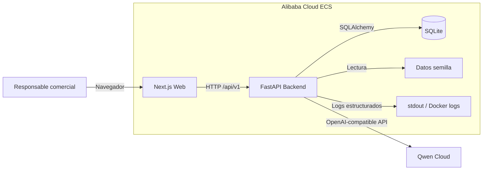
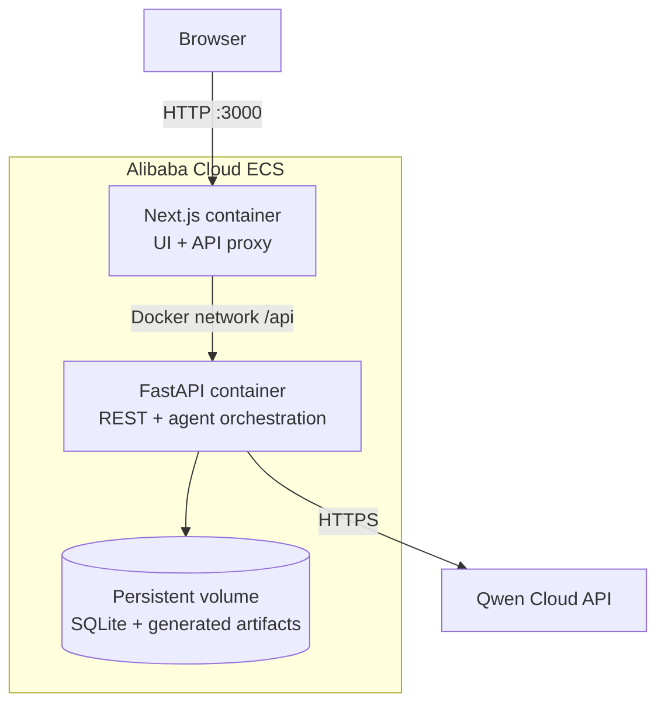
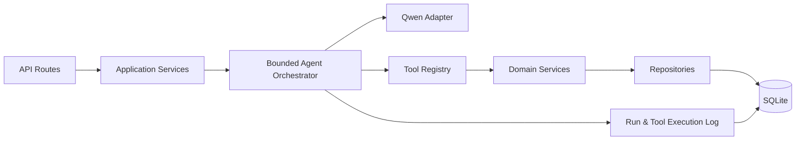

# Arquitectura general

## Decisión resumida

AdegaFlow AI se implementará como un **monolito modular en un monorepo**, con dos contenedores desplegables:

1. **Web:** Next.js + TypeScript.
2. **API:** FastAPI + Python.

La API contendrá el orquestador, los adaptadores de Qwen Cloud, las herramientas, la lógica de dominio, los repositorios y la persistencia SQLite. El frontend solo presentará el flujo y consumirá la API.

## Motivo

El proyecto necesita profundidad técnica y trazabilidad, pero dispone de un calendario muy corto. La separación web/API permite mostrar una arquitectura profesional sin introducir el coste operativo de microservicios.

## Diagrama de contexto

## Diagrama de contenedores

## Componentes del backend

## Responsabilidades

### Frontend

- entrada de consultas;
- selección de escenario demo;
- estado de ejecución;
- visualización de datos extraídos;
- herramientas ejecutadas;
- recomendación y stock;
- propuesta;
- borrador;
- CRM simulado;
- seguimiento;
- memoria;
- revisión humana final.

El frontend no contiene reglas de negocio ni claves de Qwen Cloud.

### Backend

- validar entradas;
- persistir consultas;
- ejecutar el flujo;
- invocar Qwen Cloud;
- validar respuestas estructuradas;
- decidir y ejecutar herramientas;
- aplicar reglas deterministas;
- registrar oportunidades, propuestas, tareas y memoria;
- exponer trazabilidad;
- manejar errores y reintentos.

### Qwen Cloud

- análisis semántico del mensaje;
- extracción inicial estructurada;
- selección razonada de herramientas dentro de límites;
- recomendación contextual;
- redacción de propuesta y correo.

Qwen Cloud no será fuente de verdad para precio, stock, identidad de productos ni estado del CRM.

### Persistencia

SQLite conservará:

- consultas;
- compradores;
- memoria;
- catálogo;
- inventario;
- oportunidades;
- cotizaciones;
- artefactos;
- seguimientos;
- ejecuciones del agente;
- ejecuciones de herramientas.

## Límites entre IA y lógica determinista

| Responsabilidad | IA | Backend determinista |
|---|---:|---:|
| Detectar intención | Sí | Valida esquema |
| Extraer campos | Sí | Valida tipos y reglas |
| Detectar faltantes | Sí | Contrasta campos obligatorios |
| Elegir productos candidatos | Sí | Filtra catálogo y stock |
| Consultar stock | No | Sí |
| Calcular precios y totales | No | Sí |
| Crear CRM y seguimiento | No | Sí |
| Redactar narrativa comercial | Sí | Inserta datos verificados |
| Enviar correo | No | No existe en MVP |
| Aprobar condiciones | No | Revisión humana |

## Principios

1. **La IA propone; el dominio valida.**
2. **Las tools son la única vía para datos operativos.**
3. **Toda ejecución tiene un identificador de correlación.**
4. **No existen bucles agentic sin límite.**
5. **Las acciones externas irreversibles no forman parte del MVP.**
6. **El error debe ser visible y recuperable.**
