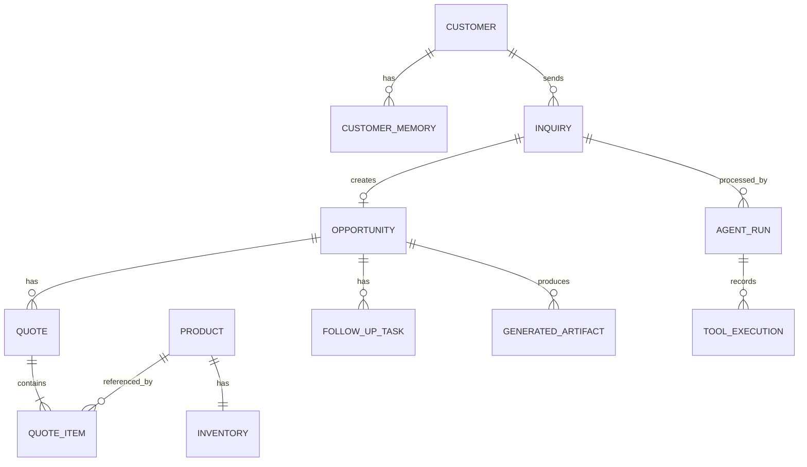

# Modelo de datos

## Objetivo

Persistir solo lo necesario para completar el flujo, demostrar memoria entre sesiones y ofrecer trazabilidad.

## Diagrama entidad-relación

## Entidades

### `customers`

| Campo | Tipo | Regla |
|---|---|---|
| id | UUID | PK |
| company_name | string | obligatorio |
| country_code | string(2) | ISO 3166-1 alpha-2 |
| contact_name | string | opcional |
| email | string | opcional, validado |
| preferred_language | string | ISO 639-1 |
| created_at | datetime | UTC |
| updated_at | datetime | UTC |

### `customer_memories`

Memorias explícitas y auditables; no embeddings.

| Campo | Tipo | Regla |
|---|---|---|
| id | UUID | PK |
| customer_id | UUID | FK |
| category | enum | preference, requirement, interaction, constraint |
| content | text | hecho resumido |
| confidence | decimal | 0–1 |
| source_inquiry_id | UUID | FK opcional |
| is_active | boolean | permite invalidar |
| created_at | datetime | UTC |
| invalidated_at | datetime | opcional |

### `products`

| Campo | Tipo | Regla |
|---|---|---|
| id | UUID | PK |
| sku | string | único |
| name | string | obligatorio |
| category | string | joven, lías, espumoso, parcela, etc. |
| variety | string | ejemplo: Albariño |
| vintage | integer | opcional |
| description | text | obligatorio |
| price_cents | integer | EUR, no `float` |
| units_per_case | integer | > 0 |
| recommended_markets | JSON | lista |
| recommended_channels | JSON | lista de canales comerciales |
| tasting_notes | text | opcional |
| certifications | JSON | lista |
| active | boolean | default true |

### `inventory`

| Campo | Tipo | Regla |
|---|---|---|
| product_id | UUID | PK/FK |
| available_bottles | integer | >= 0 |
| reserved_bottles | integer | >= 0 |
| updated_at | datetime | UTC |

Stock vendible = `available_bottles - reserved_bottles`.

### `inquiries`

| Campo | Tipo | Regla |
|---|---|---|
| id | UUID | PK |
| customer_id | UUID | FK opcional |
| source | enum | manual, demo, email_simulated |
| raw_message | text | obligatorio |
| detected_language | string | opcional hasta análisis |
| status | enum | new, processing, completed, failed |
| extracted_data | JSON | esquema versionado |
| missing_fields | JSON | lista |
| received_at | datetime | UTC |

### `opportunities`

| Campo | Tipo | Regla |
|---|---|---|
| id | UUID | PK |
| inquiry_id | UUID | FK único |
| customer_id | UUID | FK |
| title | string | obligatorio |
| stage | enum | qualified, proposal_draft, follow_up |
| priority | enum | low, medium, high |
| score | integer | 0–100; explicable |
| market | string | país/mercado |
| channel | string | opcional |
| estimated_bottles | integer | opcional |
| target_date | date | opcional |
| summary | text | obligatorio |
| created_at | datetime | UTC |
| updated_at | datetime | UTC |

### `quotes`

| Campo | Tipo | Regla |
|---|---|---|
| id | UUID | PK |
| opportunity_id | UUID | FK |
| currency | string | EUR |
| subtotal_cents | integer | calculado |
| status | enum | draft, reviewed |
| assumptions | JSON | visible en la propuesta |
| created_at | datetime | UTC |

### `quote_items`

| Campo | Tipo | Regla |
|---|---|---|
| id | UUID | PK |
| quote_id | UUID | FK |
| product_id | UUID | FK |
| quantity_bottles | integer | > 0 |
| unit_price_cents | integer | snapshot |
| line_total_cents | integer | calculado |
| cases | integer | derivado o explícito |

### `follow_up_tasks`

| Campo | Tipo | Regla |
|---|---|---|
| id | UUID | PK |
| opportunity_id | UUID | FK |
| title | string | obligatorio |
| due_at | datetime | UTC |
| status | enum | pending, completed |
| created_at | datetime | UTC |

### `generated_artifacts`

| Campo | Tipo | Regla |
|---|---|---|
| id | UUID | PK |
| opportunity_id | UUID | FK |
| artifact_type | enum | proposal, email_draft |
| language | string | ISO 639-1 |
| content | JSON/text | versionado |
| review_status | enum | needs_review, approved |
| created_at | datetime | UTC |

### `agent_runs`

| Campo | Tipo | Regla |
|---|---|---|
| id | UUID | PK |
| inquiry_id | UUID | FK |
| status | enum | queued, running, completed, failed, needs_review |
| model | string | modelo efectivo |
| prompt_versions | JSON | mapa de prompts |
| started_at | datetime | UTC |
| completed_at | datetime | opcional |
| current_step | string | visible en UI |
| error_code | string | opcional |
| error_message_safe | string | opcional |

### `tool_executions`

| Campo | Tipo | Regla |
|---|---|---|
| id | UUID | PK |
| agent_run_id | UUID | FK |
| sequence | integer | orden |
| tool_name | string | obligatorio |
| input_payload | JSON | secretos excluidos |
| output_payload | JSON | resumido si es grande |
| status | enum | started, succeeded, failed |
| started_at | datetime | UTC |
| duration_ms | integer | >= 0 |
| error_code | string | opcional |

## Estrategia de migración

- SQLAlchemy 2.0 como ORM.
- Alembic para migraciones.
- SQLite durante el MVP.
- Repositorios evitan dependencia directa del motor.
- Una migración futura a PostgreSQL no debe cambiar contratos de dominio.

## Datos que no se persistirán

- razonamiento interno o cadena de pensamiento;
- API keys;
- respuestas completas del proveedor cuando no sean necesarias;
- datos personales innecesarios;
- comunicaciones enviadas, porque no se envían en el MVP.
