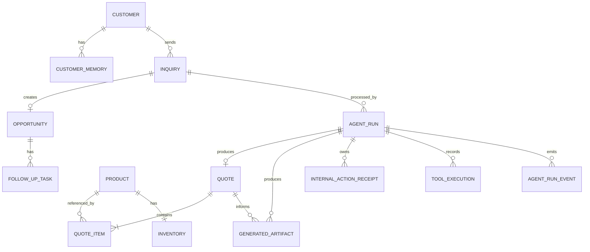

# Modelo de datos

## Objetivo

Persistir solo lo necesario para completar el flujo, demostrar memoria entre sesiones y ofrecer trazabilidad.

## Diagrama entidad-relación



## Entidades

### `customers`

| Campo | Tipo | Regla |
|---|---|---|
| id | UUID | PK |
| company_name | string | obligatorio |
| country_code | string(2) | ISO 3166-1 alpha-2 |
| contact_name | string | opcional |
| email | string | opcional, validado |
| preferred_language | string | ISO 639-1 |
| created_at | datetime | UTC |
| updated_at | datetime | UTC |

### `customer_memories`

Memorias explícitas y auditables; no embeddings.

| Campo | Tipo | Regla |
|---|---|---|
| id | UUID | PK |
| customer_id | UUID | FK |
| category | enum | preference, requirement, interaction, constraint |
| content | text | hecho resumido |
| confidence | decimal | 0–1 |
| source_inquiry_id | UUID | FK opcional |
| is_active | boolean | permite invalidar |
| created_at | datetime | UTC |
| invalidated_at | datetime | opcional |

### `products`

| Campo | Tipo | Regla |
|---|---|---|
| id | UUID | PK |
| sku | string | único |
| name | string | obligatorio |
| category | string | joven, lías, espumoso, parcela, etc. |
| variety | string | ejemplo: Albariño |
| vintage | integer | opcional |
| description | text | obligatorio |
| price_cents | integer | EUR, no `float` |
| units_per_case | integer | > 0 |
| recommended_markets | JSON | lista |
| recommended_channels | JSON | lista de canales comerciales |
| tasting_notes | text | opcional |
| certifications | JSON | lista |
| active | boolean | default true |

### `inventory`

| Campo | Tipo | Regla |
|---|---|---|
| product_id | UUID | PK/FK |
| available_bottles | integer | >= 0 |
| reserved_bottles | integer | >= 0 |
| updated_at | datetime | UTC |

Stock vendible:

```text
max(0, available_bottles - reserved_bottles)
```

### `inquiries`

| Campo | Tipo | Regla |
|---|---|---|
| id | UUID | PK |
| customer_id | UUID | FK opcional |
| source | enum | manual, demo, email_simulated |
| raw_message | text | obligatorio |
| detected_language | string | opcional hasta análisis |
| status | enum | new, processing, completed, failed |
| extracted_data | JSON | esquema versionado |
| missing_fields | JSON | lista |
| received_at | datetime | UTC |
| submission_key | string | nullable, único; idempotencia HTTP |

`extracted_data` conserva únicamente datos que validan contra el esquema estructurado vigente. `missing_fields` se calcula mediante reglas de aplicación, no mediante opinión del modelo.

### `opportunities`

| Campo | Tipo | Regla |
|---|---|---|
| id | UUID | PK |
| inquiry_id | UUID | FK único |
| customer_id | UUID | FK |
| title | string | obligatorio |
| stage | enum | qualified, proposal_draft, follow_up |
| priority | enum | low, medium, high |
| score | integer | 0–100; explicable |
| market | string | país/mercado |
| channel | string | opcional |
| estimated_bottles | integer | opcional |
| target_date | date | opcional |
| summary | text | obligatorio |
| created_at | datetime | UTC |
| updated_at | datetime | UTC |

Sprint 2 Bloque 7 crea como máximo una oportunidad por inquiry mediante una
acción interna determinista. No se incluyen importes ni texto generado por el
modelo en este registro.

### `quotes`

| Campo | Tipo | Regla |
|---|---|---|
| id | UUID | PK |
| agent_run_id | UUID | FK obligatorio, único |
| currency | string | EUR |
| subtotal_cents | integer | calculado |
| status | enum | draft, reviewed |
| assumptions | JSON | versionado y visible |
| created_at | datetime | UTC |

La inquiry se obtiene mediante `agent_run.inquiry_id`; no se duplican
`inquiry_id` ni `opportunity_id` en la cotización. Cuando el Bloque 7 cree una
oportunidad, la relación se resolverá mediante `opportunities.inquiry_id`, que
es único. El Bloque 6 crea como máximo una cotización por run.

### `quote_items`

| Campo | Tipo | Regla |
|---|---|---|
| id | UUID | PK |
| quote_id | UUID | FK |
| product_id | UUID | FK |
| quantity_bottles | integer | > 0 |
| unit_price_cents | integer | snapshot |
| line_total_cents | integer | calculado |
| cases | integer | derivado; cantidad divisible por caja |

Restricción:

```text
unique(quote_id, product_id)
```

### `follow_up_tasks`

| Campo | Tipo | Regla |
|---|---|---|
| id | UUID | PK |
| opportunity_id | UUID | FK |
| title | string | obligatorio |
| due_at | datetime | UTC |
| status | enum | pending, completed |
| created_at | datetime | UTC |

El Bloque 7 crea una tarea `pending` con vencimiento a siete días mediante un
reloj UTC inyectable. La idempotencia se conserva en el receipt de la acción.

### `internal_action_receipts`

Ledger mínimo para la idempotencia de las escrituras internas.

| Campo | Tipo | Regla |
|---|---|---|
| id | UUID | PK |
| agent_run_id | UUID | FK |
| action_name | enum | create_crm_opportunity, create_followup_task, save_customer_memory |
| idempotency_key | string | único |
| request_fingerprint | string(64) | SHA-256 hexadecimal |
| result_payload | JSON | referencias resumidas |
| created_at | datetime | UTC |

Restricciones:

```text
unique(idempotency_key)
unique(agent_run_id, action_name)
```

Los receipts no sustituyen `tool_executions`: el receipt permite reutilizar un
resultado y `tool_executions` conserva cada intento.

### `generated_artifacts`

| Campo | Tipo | Regla |
|---|---|---|
| id | UUID | PK |
| agent_run_id | UUID | FK obligatorio |
| quote_id | UUID | FK obligatorio |
| artifact_type | enum | proposal, email_draft |
| language | string | ISO 639-1 |
| schema_version | string | obligatorio |
| content | JSON | versionado |
| review_status | enum | needs_review, approved |
| created_at | datetime | UTC |

Restricción:

```text
unique(agent_run_id, artifact_type)
```

### `agent_runs`

Una inquiry puede tener múltiples runs. Esto permite reintentos y conserva el historial sin sobrescribir ejecuciones anteriores.

| Campo | Tipo | Regla |
|---|---|---|
| id | UUID | PK |
| inquiry_id | UUID | FK |
| correlation_id | UUID | único, visible en logs |
| status | enum | queued, running, completed, failed, needs_review |
| model | string | modelo efectivo |
| prompt_versions | JSON | mapa de prompts |
| result_payload | JSON | resultado validado o parcial |
| started_at | datetime | UTC |
| completed_at | datetime | opcional |
| current_step | string | paso visible |
| error_code | string | opcional |
| error_message_safe | string | opcional |
| request_key | string | nullable, único; comando HTTP |
| retry_of_run_id | UUID | self-FK nullable |

`status` representa el estado global. `current_step` representa la fase funcional activa.

El Bloque 8 añade idempotencia al límite HTTP sin reutilizar los receipts de
acciones internas. `request_key` evita crear o encolar dos veces el mismo run.
`retry_of_run_id` conserva el intento original; un retry siempre crea una nueva
fila y no sobrescribe eventos, tools o resultados anteriores.

Los registros históricos y seeds pueden conservar ambos campos en null.

Pasos implementados hasta el Bloque 5:

- queued;
- analyzing;
- retrieving_memory;
- selecting_products;
- checking_stock;
- validating_recommendation;
- completed;
- needs_review;
- failed.

El Bloque 6 añade:

- calculating_quote;
- generating_artifacts.

El Bloque 7 añade:

- persisting_actions.

El Bloque 8 no añade pasos funcionales del agente. Añade el ciclo externo de
queue, polling, recuperación de interrupciones y retry mediante runs nuevos.

`result_payload` conserva la recomendación validada y puede añadir referencias
resumidas a la cotización y los artefactos. El contenido completo permanece en
sus tablas correspondientes.

### `tool_executions`

| Campo | Tipo | Regla |
|---|---|---|
| id | UUID | PK |
| agent_run_id | UUID | FK |
| sequence | integer | orden por run |
| tool_name | string | obligatorio |
| input_payload | JSON | secretos excluidos |
| output_payload | JSON | resumido si es grande |
| status | enum | started, succeeded, failed, rejected |
| started_at | datetime | UTC |
| duration_ms | integer | >= 0 |
| error_code | string | opcional |

Restricción:

```text
unique(agent_run_id, sequence)
```

Cada intento cuenta dentro del límite del run, incluso cuando se rechaza por tool desconocida, argumentos inválidos o límite alcanzado.

### `agent_run_events`

Eventos funcionales visibles para auditoría y futura interfaz.

| Campo | Tipo | Regla |
|---|---|---|
| id | UUID | PK |
| agent_run_id | UUID | FK |
| sequence | integer | orden por run |
| event_type | string | obligatorio |
| step | string | fase asociada |
| payload | JSON | resumen seguro |
| created_at | datetime | UTC |

Restricción:

```text
unique(agent_run_id, sequence)
```

Eventos mínimos del Bloque 5:

- run_created;
- step_changed;
- analysis_reused;
- analysis_completed;
- memory_retrieval_skipped;
- memory_retrieved;
- model_round_completed;
- tool_requested;
- tool_started;
- tool_succeeded;
- tool_failed;
- tool_rejected;
- recommendation_received;
- recommendation_rejected;
- recommendation_validated;
- run_completed;
- run_needs_review;
- run_failed.

El Bloque 7 añade eventos para resolución de customer, oportunidad,
seguimiento, memoria, reutilización o rechazo idempotente, rollback y cierre de
acciones internas. Los nombres vinculantes se definen en
`063-internal-actions.md`.

Los eventos no almacenan cadena de pensamiento. Solo contienen identificadores, conteos, resultados resumidos, reglas aplicadas, estados y errores seguros.

## Recomendación de producto

No se crea una tabla `recommendations` en el MVP.

La recomendación se persiste en `agent_runs.result_payload` porque:

- todavía no posee un ciclo de vida independiente;
- no existe API de recomendaciones;
- la cotización posee un ciclo de vida separado y no modifica la recomendación;
- no se reserva inventario;
- crear un agregado adicional aumentaría el alcance sin valor inmediato.

La recomendación validada conserva:

- product_id;
- SKU;
- nombre;
- cantidad;
- unidades por caja;
- cajas;
- precio unitario en céntimos;
- stock vendible observado;
- rationale;
- resumen;
- advertencias;
- estado de validación.

No conserva subtotal, impuestos, transporte, aranceles ni margen.

## Estrategia de migración

- SQLAlchemy 2.0 como ORM.
- Alembic para migraciones.
- SQLite durante el MVP.
- Repositorios evitan dependencia directa del motor.
- Una migración futura a PostgreSQL no debe cambiar contratos de dominio.
- La migración de trazabilidad debe ser reversible.
- Las llamadas a Qwen no se realizan dentro de transacciones SQLite abiertas.

## Datos que no se persistirán

- razonamiento interno o cadena de pensamiento;
- API keys;
- cabeceras de autorización;
- variables de entorno completas;
- respuestas completas del proveedor cuando no sean necesarias;
- datos personales innecesarios;
- comunicaciones enviadas, porque no se envían en el MVP;
- cotizaciones en Sprint 2 Bloque 5;
- reservas de stock;
- tasas de cambio inventadas.
