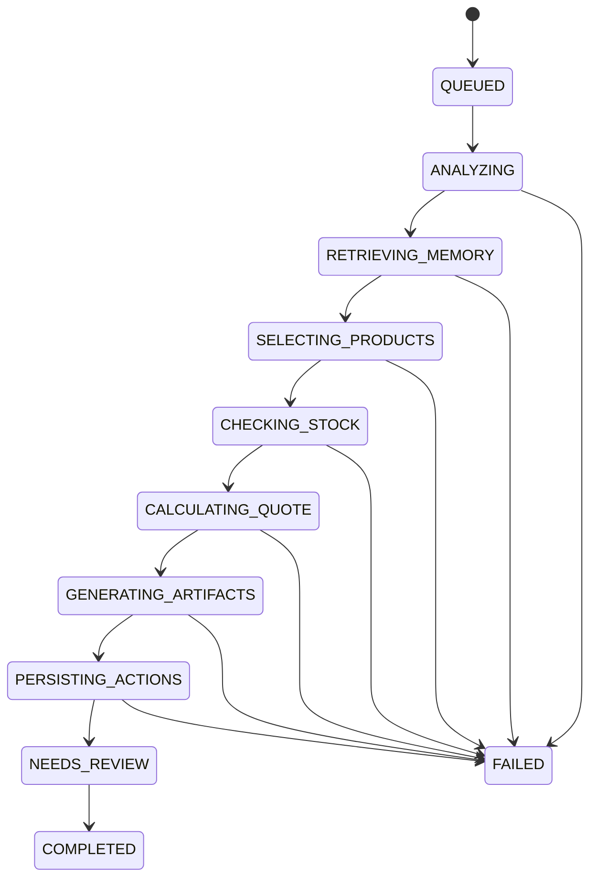

# Estrategia de orquestación del agente

## Decisión

Se implementará un **orquestador único, acotado y basado en estados**, con capacidades lógicas especializadas. No se implementará una sociedad de agentes ni un bucle ReAct abierto.

## Motivo

El caso de uso es secuencial, con reglas verificables y una fecha de entrega cercana. Separar agentes físicamente aumentaría latencia, coste, errores y dificultad de depuración sin demostrar un beneficio medible.

## Estado de ejecución

## Flujo detallado

### 1. Ingesta

- guardar mensaje original;
- detectar o asociar comprador;
- crear `agent_run`;
- asignar `correlation_id`.

### 2. Análisis estructurado

Qwen Cloud recibe:

- mensaje original;
- esquema de salida;
- política de no invención;
- campos esperados.

Devuelve JSON con:

- idioma;
- intención;
- tipo de comprador;
- datos comerciales;
- campos faltantes;
- señales de prioridad;
- resumen.

El backend valida con Pydantic y aplica una corrección controlada si el JSON no es válido.

### 3. Recuperación de memoria

`retrieve_customer_history` devuelve hechos activos, preferencias y oportunidades previas. El agente solo recibe el contexto relevante.

### 4. Selección asistida de productos

Qwen Cloud recibe herramientas de lectura:

- `search_catalog`;
- `get_product_details`;
- `check_stock`.

La aplicación ejecuta las llamadas y devuelve los resultados al modelo. El ciclo finaliza cuando:

- existe una selección válida;
- el modelo no solicita más tools;
- se alcanza el máximo de rondas.

**Límite MVP:** máximo 6 rondas y máximo 10 ejecuciones de tools por run.

### 5. Validación determinista

El backend verifica:

- productos activos;
- disponibilidad;
- suma de cantidades;
- formato de cajas;
- moneda;
- precio;
- ausencia de certificaciones inventadas.

Una recomendación inválida se rechaza y se solicita una corrección con el error estructurado.

### 6. Cotización

`calculate_quote` calcula importes. El modelo no realiza aritmética monetaria vinculante.

### 7. Artefactos

- `generate_proposal` produce una estructura de propuesta;
- Qwen redacta la narrativa usando únicamente datos verificados;
- `draft_email` prepara la respuesta en el idioma detectado;
- ambos quedan en estado `needs_review`.

### 8. Acciones internas

Tras validar los resultados:

- `create_crm_opportunity`;
- `create_followup_task`;
- `save_customer_memory`.

Estas acciones son reversibles dentro de la demo y no afectan sistemas externos.

### 9. Punto de control humano

La interfaz muestra:

- propuesta;
- correo;
- supuestos;
- datos faltantes;
- acciones ejecutadas;
- advertencias.

No existe tool de envío real.

## Política de tools

| Clase | Ejemplos | Ejecución |
|---|---|---|
| Lectura | catálogo, stock, historial | El modelo puede solicitarlas |
| Cálculo | cotización | Orquestador o modelo, siempre validada |
| Escritura interna | CRM, seguimiento, memoria | Orquestador tras validación |
| Acción externa | enviar email, reservar stock | No disponible en MVP |

## Fallbacks

1. **JSON inválido:** segundo intento de reparación; luego fallo controlado.
2. **Tool desconocida:** rechazo, log y corrección.
3. **Parámetros inválidos:** error estructurado al modelo.
4. **Stock insuficiente:** nueva selección o respuesta de clarificación.
5. **Qwen no disponible:** mostrar estado fallido y permitir reintentar.
6. **Rondas agotadas:** finalizar como `needs_review` con resultados parciales.

## Lo que no se almacenará

No se persistirá cadena de pensamiento. La trazabilidad mostrará:

- decisión resumida;
- tool solicitada;
- parámetros;
- resultado;
- regla aplicada;
- estado.

Esto es suficiente para auditoría de producto sin exponer razonamiento privado del modelo.
