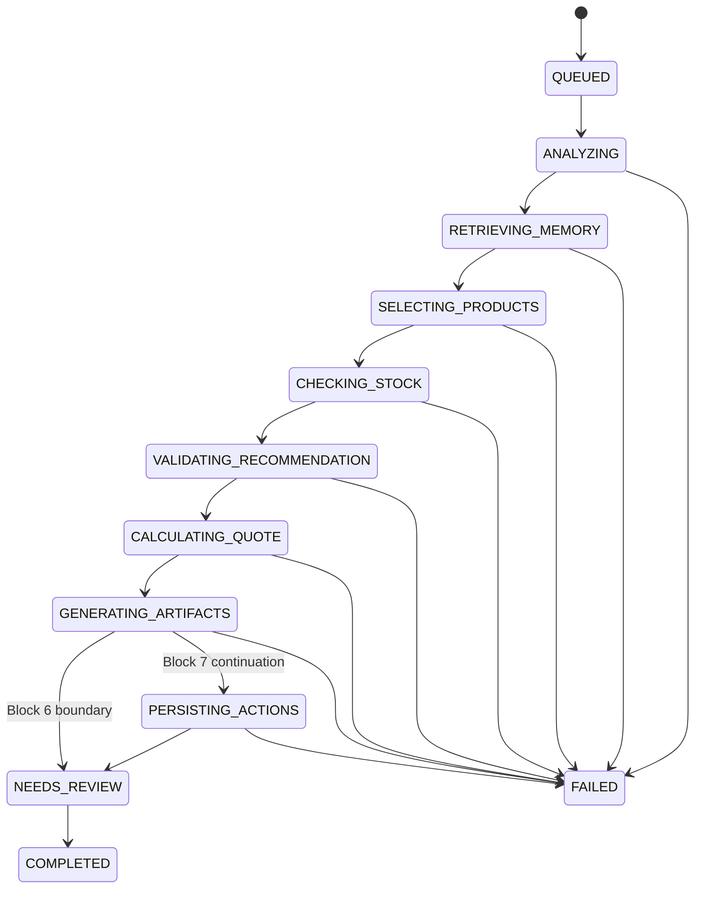

# Estrategia de orquestación del agente

## Decisión

Se implementará un **orquestador único, acotado y basado en estados**, con capacidades lógicas especializadas. No se implementará una sociedad de agentes ni un bucle ReAct abierto.

## Motivo

El caso de uso es secuencial, con reglas verificables y una fecha de entrega cercana. Separar agentes físicamente aumentaría latencia, coste, errores y dificultad de depuración sin demostrar un beneficio medible.

## Estado global y paso actual

`agent_runs.status` representa el estado global:

- `queued`;
- `running`;
- `completed`;
- `needs_review`;
- `failed`.

`agent_runs.current_step` representa la fase funcional:

- `queued`;
- `analyzing`;
- `retrieving_memory`;
- `selecting_products`;
- `checking_stock`;
- `validating_recommendation`;
- `calculating_quote`;
- `generating_artifacts`;
- `persisting_actions`;
- `completed`;
- `needs_review`;
- `failed`.

La separación evita convertir cada paso interno en un estado global incompatible con reintentos o futuras ampliaciones.

## Estado de ejecución completo



Sprint 2 Bloque 5 finaliza en `completed`, `needs_review` o `failed`
después de la validación de la recomendación.

Sprint 2 Bloque 6 extiende los nuevos runs desde una recomendación válida hacia
`calculating_quote` y `generating_artifacts`. El camino feliz termina
`needs_review` porque la propuesta y el correo requieren revisión humana. Las
acciones internas permanecen fuera de este bloque.

Sprint 2 Bloque 7 permite que los nuevos runs con quote, propuesta y correo
válidos continúen a `persisting_actions`. Después de crear CRM simulado,
seguimiento y memoria, el run sigue terminando `needs_review`; las acciones
internas no aprueban los artefactos.

## Flujo detallado

### 1. Ingesta

- guardar mensaje original;
- asociar comprador cuando ya se conozca;
- crear `agent_run`;
- asignar `correlation_id`;
- registrar `run_created`.

La creación automática de compradores queda fuera del Bloque 5.

### 2. Análisis estructurado

Qwen Cloud recibe:

- mensaje original;
- esquema de salida;
- política de no invención;
- campos esperados.

Devuelve JSON con:

- idioma;
- intención;
- mercado;
- datos comerciales;
- producto de interés;
- volumen;
- canal;
- horizonte o fecha;
- solicitudes de muestras y precios;
- información de comprador cuando exista.

El backend:

- valida con Pydantic;
- normaliza códigos;
- calcula campos faltantes de forma determinista;
- persiste únicamente datos válidos.

Un análisis ya persistido se reutiliza solo si vuelve a validar contra el esquema vigente. La reutilización se registra como `analysis_reused`.

### 3. Recuperación de memoria

Cuando existe `customer_id`, `retrieve_customer_history` se ejecuta de forma determinista antes de seleccionar productos.

La tool devuelve:

- hechos activos;
- preferencias;
- restricciones;
- interacciones;
- oportunidades anteriores resumidas.

Solo el contexto relevante se entrega al modelo.

Cuando no existe `customer_id`:

- no se crea un cliente;
- la recuperación se omite;
- se registra `memory_retrieval_skipped`;
- el flujo puede continuar sin memoria.

### 4. Tool registry

Existe una allowlist cerrada con exactamente:

- `search_catalog`;
- `get_product_details`;
- `check_stock`;
- `retrieve_customer_history`.

Cada entrada del registry contiene:

- nombre;
- descripción;
- modelo Pydantic de entrada;
- JSON Schema;
- ejecutor local;
- versión;
- política de reintento.

El modelo nunca proporciona rutas, módulos, funciones ni código ejecutable.

Durante la fase de selección se exponen a Qwen:

- `search_catalog`;
- `get_product_details`;
- `check_stock`.

`retrieve_customer_history` permanece en el registry, pero se invoca de forma determinista antes del ciclo de selección.

### 5. Selección asistida de productos

Qwen Cloud recibe:

- mensaje original;
- análisis validado;
- campos faltantes;
- memoria relevante;
- resultados acumulados de tools;
- política de no invención;
- esquema del borrador de recomendación.

La aplicación ejecuta las llamadas y devuelve resultados estructurados al modelo.

El ciclo finaliza cuando:

- existe un borrador de recomendación;
- el modelo no solicita más tools;
- se alcanza el máximo de rondas;
- se alcanza el máximo de ejecuciones;
- ocurre un fallo no recuperable.

### 6. Límites del MVP

```text
MAX_MODEL_ROUNDS = 6
MAX_TOOL_EXECUTIONS = 10
MAX_READ_TOOL_RETRIES = 1
MAX_RECOMMENDATION_CORRECTIONS = 1
```

Reglas:

- cada llamada lógica al modelo incrementa las rondas;
- cada intento de tool incrementa las ejecuciones;
- múltiples tool calls se procesan en orden;
- no se inicia una ejecución que exceda el límite;
- no existe recursión agentic;
- al agotar límites, el run termina `needs_review`.

### 7. Borrador de recomendación

El modelo devuelve únicamente:

- schema_version;
- product_id;
- quantity_bottles;
- rationale;
- summary;
- warnings.

El modelo no es fuente de verdad para:

- SKU;
- nombre oficial;
- precio;
- moneda;
- stock;
- cajas;
- unidades por caja;
- certificaciones.

El backend enriquece la recomendación utilizando exclusivamente resultados verificados de catálogo y stock.

### 8. Validación determinista

El backend verifica:

- productos existentes y activos;
- ausencia de IDs duplicados;
- productos obtenidos previamente mediante tools;
- detalles recuperados;
- disponibilidad consultada;
- suma de cantidades;
- cantidades positivas;
- divisibilidad por caja;
- número derivado de cajas;
- stock suficiente;
- coincidencia de mercado y canal;
- certificaciones requeridas;
- moneda;
- precio unitario proveniente del catálogo.

Una recomendación inválida se rechaza con errores estructurados.

Errores corregibles permiten una sola corrección del modelo:

- suma incorrecta;
- cantidad no divisible por caja;
- producto duplicado;
- stock insuficiente;
- selección fuera del conjunto recuperado.

No se corrige silenciosamente la selección del modelo.

### 9. Resultado del Bloque 5

Una recomendación válida se persiste en `agent_runs.result_payload`.

El resultado puede contener:

- productos validados;
- cantidades;
- cajas;
- precios unitarios;
- stock observado;
- rationale;
- resumen;
- advertencias;
- total de botellas;
- moneda EUR;
- estado de validación.

No contiene:

- subtotal;
- impuestos;
- transporte;
- aranceles;
- margen;
- cotización.

### 10. Aplicación limitada del presupuesto

Cuando existen presupuesto total en EUR y volumen estimado:

```text
max_unit_price_cents = budget_total_cents // estimated_bottles
```

Ese valor puede aplicarse como filtro conservador de catálogo.

No se realizan:

- conversiones de moneda;
- cálculos de oferta;
- distribución monetaria por producto;
- cotizaciones.

Cuando la moneda no es EUR o falta, el presupuesto no se aplica y se añade una advertencia.

### 11. Transacciones

No se mantiene una transacción SQLite abierta durante una llamada a Qwen.

Patrón:

```text
persist state/event
commit
call provider
validate response
persist state/event
commit
```

Las tools de lectura no modifican catálogo, inventario ni memoria.

### 12. Cotización

`calculate_quote` es una capacidad determinista invocada por el orquestador
después de validar la recomendación. No se expone a Qwen dentro del tool
registry.

La aplicación calcula con enteros en céntimos:

```text
line_total_cents = quantity_bottles * unit_price_cents
subtotal_cents = sum(line_total_cents)
cases = quantity_bottles // units_per_case
quantity_bottles % units_per_case = 0
```

La fuente de precios es el snapshot de la recomendación validada. Solo se admite
EUR. No se calculan impuestos, transporte, seguros, aranceles, descuentos,
margen ni conversiones. La cotización no reserva stock y se persiste como
`draft`.

### 13. Artefactos

- `proposal_writer.v1` genera únicamente narrativa estructurada;
- `email_writer.v1` genera únicamente narrativa estructurada;
- el backend ensambla productos, cantidades, precios, subtotal, moneda,
  supuestos y exclusiones;
- ambos artefactos se persisten con `review_status=needs_review`;
- cada prompt permite un intento inicial y una reparación controlada;
- no existen tool calls durante la redacción;
- no existe envío real, PDF ni aprobación automática.

### 14. Acciones internas

Después de validar la pertenencia de quote y ambos artefactos, el orquestador:

1. resuelve o crea un customer mínimo identificable;
2. ejecuta `create_crm_opportunity`;
3. ejecuta `create_followup_task`;
4. ejecuta `save_customer_memory`;
5. persiste receipts, referencias y eventos;
6. termina en `needs_review`.

Las tres capacidades son internas, tipadas y registradas, pero no seleccionables
por Qwen. Score, prioridad, fecha de seguimiento y memorias se derivan mediante
reglas de ADR-013. La unidad completa es atómica y no afecta sistemas externos.

### 15. Punto de control humano

La futura interfaz mostrará:

- recomendación;
- propuesta;
- correo;
- supuestos;
- datos faltantes;
- acciones ejecutadas;
- advertencias.

No existe tool de envío real.

## Política de tools

| Clase | Ejemplos | Ejecución |
|---|---|---|
| Lectura | catálogo, stock, historial | Modelo o fase determinista |
| Cálculo | cotización | Orquestador determinista; nunca Qwen |
| Escritura interna | CRM, seguimiento, memoria | Orquestador tras validación |
| Acción externa | enviar email, reservar stock | No disponible en MVP |

## Estados terminales del Bloque 5

| Condición | Estado |
|---|---|
| Recomendación válida | completed |
| Resultado parcial útil | needs_review |
| Stock insuficiente sin alternativa | needs_review |
| Sin candidatos compatibles | needs_review |
| Límite alcanzado | needs_review |
| Tool desconocida no corregida | needs_review |
| JSON inválido después de reparación | failed |
| Qwen no disponible definitivamente | failed |
| Error de persistencia | failed |
| Error inesperado | failed |

## Estados terminales del Bloque 6

| Condición | Estado |
|---|---|
| Cotización y ambos artefactos persistidos | needs_review |
| Cotización válida y artefacto parcial | needs_review |
| Moneda distinta de EUR | needs_review |
| Presupuesto EUR excedido | needs_review con warning |
| Qwen no disponible después de cotizar | needs_review |
| Recomendación ausente o inválida | failed |
| Inconsistencia aritmética | failed |
| Error de persistencia | failed |

## Estados terminales del Bloque 7

| Condición | Estado |
|---|---|
| Oportunidad, seguimiento y memoria persistidos | needs_review |
| Operaciones idempotentes reutilizadas | needs_review |
| Sin hechos de memoria permitidos | needs_review con warning |
| Identidad insuficiente para customer nuevo | needs_review |
| Conflicto de idempotencia | needs_review |
| Precondición de artefactos incompleta | needs_review |
| Error de validación de acciones | needs_review |
| Error transaccional recuperable | rollback y needs_review |
| Imposibilidad de persistir estado seguro | error de infraestructura |

## Fallbacks

1. **JSON inválido:** segundo intento de reparación; luego fallo controlado.
2. **Tool desconocida:** rechazo, registro y corrección controlada.
3. **Parámetros inválidos:** error estructurado al modelo.
4. **Stock insuficiente:** nueva selección o `needs_review`.
5. **Qwen no disponible:** estado fallido y posibilidad de reintento futuro.
6. **Rondas agotadas:** `needs_review` con resultados parciales.
7. **Tools agotadas:** `needs_review`; no se ejecutan llamadas adicionales.
8. **Persistencia fallida:** rollback y error seguro.

## Lo que no se almacenará

No se persistirá cadena de pensamiento. La trazabilidad mostrará:

- decisión resumida;
- tool solicitada;
- parámetros validados;
- resultado resumido;
- regla aplicada;
- estado;
- error seguro;
- duración.

Esto es suficiente para auditoría de producto sin exponer razonamiento privado del modelo.
