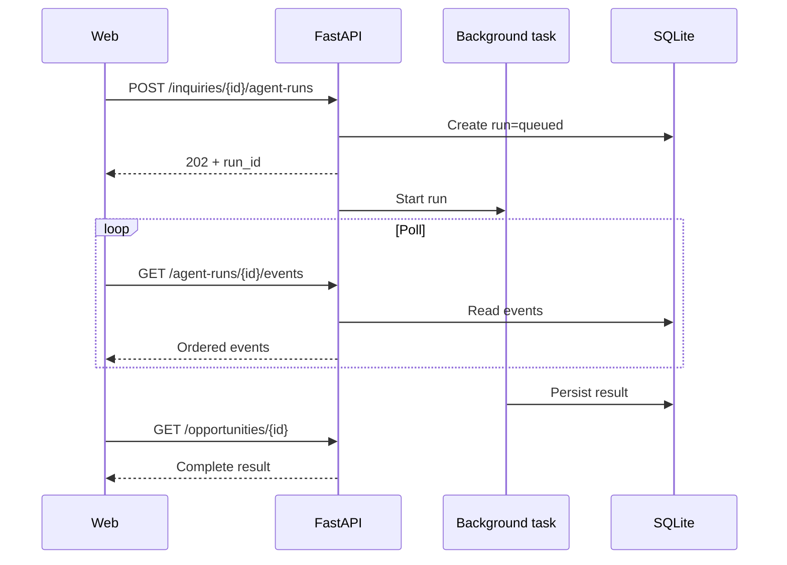

# Contratos API

## Convenciones

- Base path: `/api/v1`.
- JSON.
- IDs UUID.
- Fechas ISO 8601 UTC.
- OpenAPI generado por FastAPI.
- Errores con estructura uniforme.
- Modo demo sin autenticación completa.
- El frontend accede a la API mediante proxy interno de Next.js.

## Respuesta de error

```json
{
  "error": {
    "code": "INQUIRY_NOT_FOUND",
    "message": "Inquiry was not found.",
    "details": {},
    "correlation_id": "uuid"
  }
}
```

## Endpoints P0

### `GET /health`

Verifica proceso, base de datos y configuración no sensible.

```json
{
  "status": "ok",
  "database": "ok",
  "qwen_configured": true
}
```

### `POST /demo/reset`

Restaura datos semilla. Solo disponible con `DEMO_MODE=true`.

### `GET /demo/scenarios`

Devuelve escenarios predefinidos.

### `GET /inquiries`

Lista consultas resumidas.

Parámetros:

- `status`;
- `limit`;
- `offset`.

### `POST /inquiries`

Crea una consulta.

```json
{
  "source": "manual",
  "raw_message": "We are looking for...",
  "customer_hint": {
    "company_name": "Rhein Selection GmbH",
    "country_code": "DE"
  }
}
```

Respuesta `201`:

```json
{
  "id": "uuid",
  "status": "new",
  "received_at": "2026-07-10T18:00:00Z"
}
```

### `GET /inquiries/{inquiry_id}`

Devuelve mensaje, extracción, faltantes y relaciones.

### `POST /inquiries/{inquiry_id}/agent-runs`

Crea una ejecución y responde `202`.

```json
{
  "agent_run_id": "uuid",
  "status": "queued"
}
```

El trabajo se ejecutará en segundo plano dentro del proceso FastAPI. No se añade una cola distribuida en el MVP.

### `GET /agent-runs/{agent_run_id}`

Devuelve:

- estado;
- paso actual;
- timestamps;
- modelo;
- resumen;
- errores seguros;
- IDs de oportunidad y artefactos cuando existan.

### `GET /agent-runs/{agent_run_id}/events`

Devuelve eventos ordenados para polling.

```json
{
  "run_id": "uuid",
  "events": [
    {
      "sequence": 1,
      "type": "step_started",
      "name": "analyze_inquiry",
      "status": "succeeded",
      "timestamp": "2026-07-10T18:00:01Z",
      "summary": "Detected B2B import opportunity."
    }
  ]
}
```

### `POST /agent-runs/{agent_run_id}/retry`

Permite reintento controlado si el run terminó en fallo recuperable.

### `GET /opportunities/{opportunity_id}`

Incluye cliente, consulta, prioridad, cotización, artefactos y seguimiento.

### `GET /customers/{customer_id}/memory`

Devuelve memorias activas.

### `POST /artifacts/{artifact_id}/review`

Marca revisión conceptual:

```json
{
  "decision": "approved",
  "notes": "Demo approval only."
}
```

No envía correo ni cambia sistemas externos.

## Modelo de ejecución asíncrona



## Limitación aceptada

El procesador en segundo plano no es durable frente a reinicios. Para el MVP:

- un único worker;
- runs persistidos paso a paso;
- reintento manual;
- no se introduce Celery, Redis ni otra cola.

Una cola durable será requisito de producto futuro, no del hackathon.
