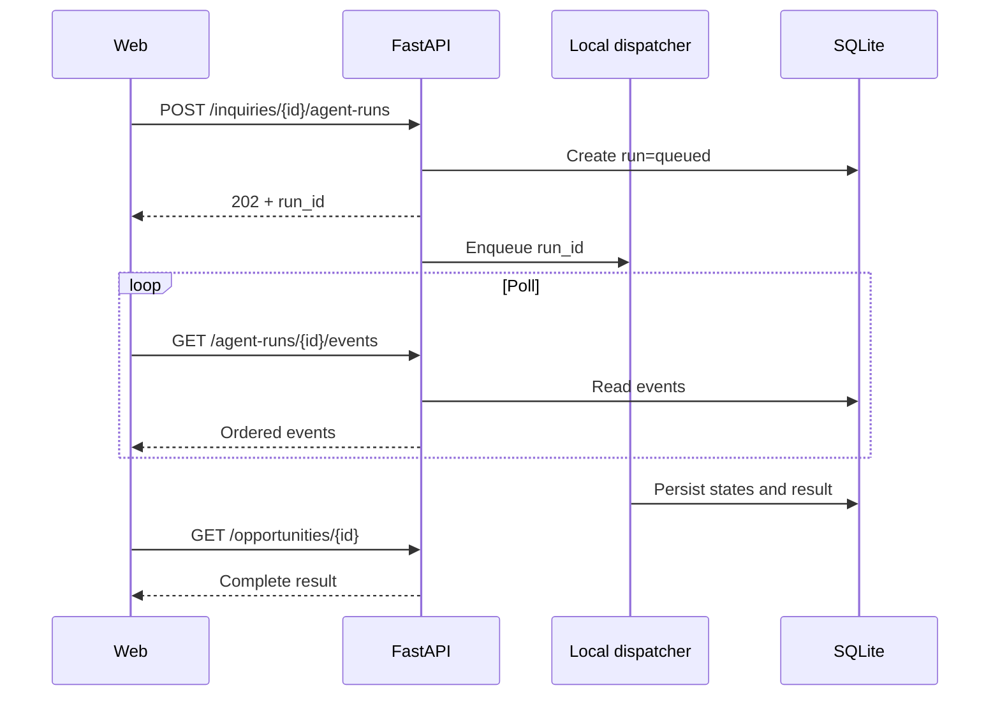

# Contratos API

## Convenciones

- Base path: `/api/v1`.
- JSON.
- IDs UUID.
- Fechas ISO 8601 UTC.
- OpenAPI generado por FastAPI.
- Errores con estructura uniforme.
- Modo demo sin autenticación completa.
- El frontend accede a la API mediante proxy interno de Next.js.
- Los comandos de creación requieren `Idempotency-Key`.
- Los endpoints de producto no poseen alias sin versión.

## Respuesta de error

```json
{
  "error": {
    "code": "INQUIRY_NOT_FOUND",
    "message": "Inquiry was not found.",
    "details": {},
    "correlation_id": "uuid"
  }
}
```

## Endpoints P0

### `GET /health`

Verifica proceso y configuración no sensible. Es la única ruta pública sin
prefijo `/api/v1`.

```json
{
  "status": "ok",
  "service": "AdegaFlow AI API",
  "version": "0.1.0",
  "environment": "development",
  "qwen_configured": true
}
```

### `GET /inquiries`

Lista consultas resumidas.

Parámetros:

- `status`;
- `limit`;
- `offset`.

El orden es estable por `received_at DESC, id DESC`. `limit` no puede superar
100.

### `POST /inquiries`

Crea una consulta.

Requiere `Idempotency-Key`. Una repetición equivalente devuelve la inquiry
existente; reutilizar la clave con otro contenido devuelve
`IDEMPOTENCY_CONFLICT`.

```json
{
  "source": "manual",
  "raw_message": "We are looking for...",
  "customer_id": null
}
```

Respuesta `201`:

```json
{
  "id": "uuid",
  "status": "new",
  "received_at": "2026-07-10T18:00:00Z"
}
```

### `GET /inquiries/{inquiry_id}`

Devuelve mensaje, extracción, faltantes y relaciones.

### `POST /inquiries/{inquiry_id}/agent-runs`

Crea una ejecución y responde `202`.

```json
{
  "agent_run_id": "uuid",
  "status": "queued"
}
```

El trabajo se ejecutará en segundo plano dentro del proceso FastAPI. No se añade una cola distribuida en el MVP.

El run y su evento inicial se confirman antes de responder. Repetir la misma
`Idempotency-Key` devuelve el run existente y no lo encola de nuevo.

### `GET /agent-runs`

Lista runs resumidos para la futura bandeja. Admite filtros por `status` e
`inquiry_id`, además de paginación acotada.

### `GET /agent-runs/{agent_run_id}`

Devuelve:

- estado;
- paso actual;
- timestamps;
- modelo;
- resumen;
- errores seguros;
- IDs de oportunidad y artefactos cuando existan.

También devuelve `retryable`, `retry_of_run_id`, última secuencia de evento y
URLs relativas para polling y resultado.

### `GET /agent-runs/{agent_run_id}/events`

Devuelve eventos ordenados para polling. Acepta `after_sequence` y `limit` para
evitar retransmitir la línea de tiempo completa.

```json
{
  "run_id": "uuid",
  "events": [
    {
      "sequence": 1,
      "type": "step_started",
      "name": "analyze_inquiry",
      "status": "succeeded",
      "timestamp": "2026-07-10T18:00:01Z",
      "summary": "Detected B2B import opportunity."
    }
  ]
}
```

### `POST /agent-runs/{agent_run_id}/retry`

Permite reintento controlado si el run terminó en fallo recuperable.

Requiere `Idempotency-Key`. Crea un nuevo run con `retry_of_run_id`; nunca
reinicia ni sobrescribe el intento original. Un run que terminó correctamente
en revisión humana no es retryable.

### `GET /agent-runs/{agent_run_id}/result`

Devuelve el read model comercial tipado para un run terminal:

- inquiry y análisis;
- recomendación;
- quote e items;
- propuesta y email draft;
- customer, oportunidad y follow-up;
- resumen de memoria;
- warnings y resultados parciales.

Mientras el run está activo devuelve `RUN_NOT_TERMINAL`.

### `GET /opportunities/{opportunity_id}`

Incluye cliente, consulta, prioridad, cotización, artefactos y seguimiento.

### `GET /customers/{customer_id}/memory`

Devuelve memorias activas.

## Modelo de ejecución asíncrona



## Limitación aceptada

El dispatcher usa una cola local acotada y un solo consumidor. No es durable
frente a reinicios. Para el MVP:

- un único worker;
- runs persistidos paso a paso;
- runs interrumpidos cerrados como `RUN_INTERRUPTED`;
- reintento manual mediante un run nuevo;
- no se introduce Celery, Redis ni otra cola.

Una cola durable será requisito de producto futuro, no del hackathon.

La aprobación o edición de artefactos, los endpoints de reset y las acciones
externas permanecen fuera del Bloque 8.
