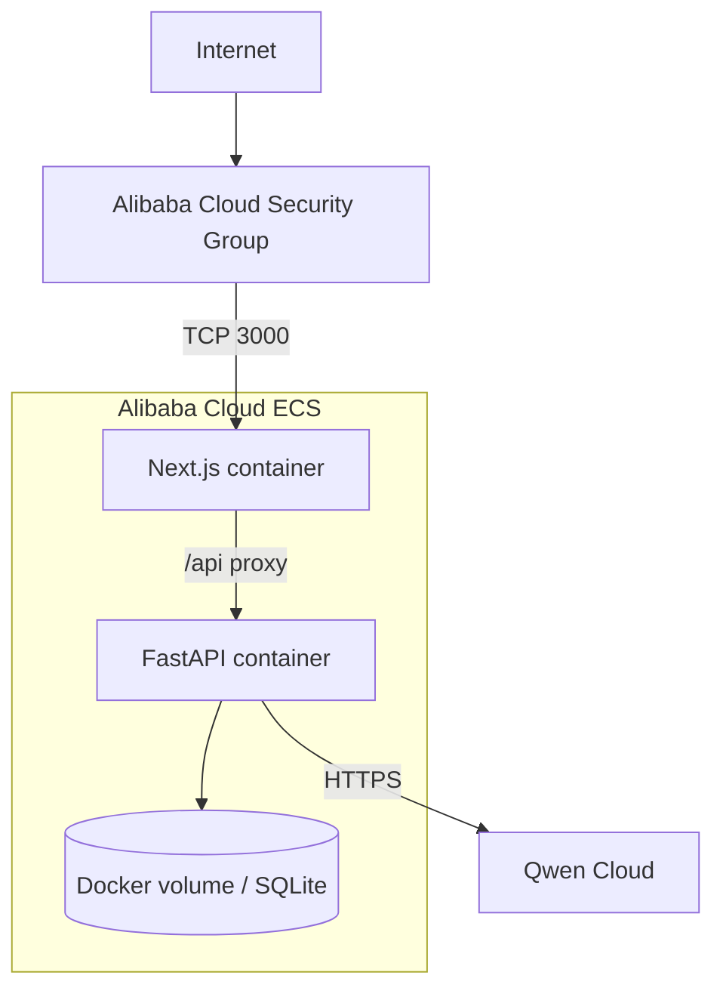

# Arquitectura de despliegue

## Requisito externo

La candidatura debe demostrar que el backend se ejecuta en Alibaba Cloud. Por tanto, un despliegue exclusivamente local o en Vercel no es suficiente.

## Decisión

Desplegar la aplicación en una instancia **Alibaba Cloud ECS** con Docker Compose.

## Topología



## Contenedores

### `web`

- expone puerto 3000;
- sirve la aplicación Next.js;
- reenvía `/api/*` al contenedor `api`;
- no contiene claves de Qwen.

### `api`

- no se expone directamente a Internet;
- escucha en la red de Docker;
- usa un único worker para compatibilidad con el procesador in-process y SQLite;
- monta volumen persistente;
- consume Qwen Cloud mediante HTTPS.

## Variables de entorno

```text
DEMO_MODE=true
DATABASE_URL=sqlite:////data/adegaflow.db
QWEN_API_KEY=...
QWEN_BASE_URL=https://dashscope-intl.aliyuncs.com/compatible-mode/v1
QWEN_MODEL=qwen3.7-plus
QWEN_FALLBACK_MODEL=qwen3.6-flash
LOG_LEVEL=INFO
```

La URL podrá sustituirse por el endpoint específico del workspace en la región internacional.

## Seguridad mínima

- API key solo en `.env` del servidor;
- `.env` excluido de Git;
- security group con el mínimo de puertos;
- backend no expuesto públicamente;
- logs sin claves ni mensajes completos innecesarios;
- datos ficticios;
- demo sin acciones externas;
- volumen con permisos restringidos.

## Prueba de despliegue para la candidatura

El repositorio deberá incluir:

- `docker-compose.yml`;
- Dockerfiles;
- `infra/alibaba-cloud/DEPLOYMENT.md`;
- evidencia de variables esperadas sin secretos;
- referencia al adaptador Qwen Cloud;
- captura o video de la app ejecutándose;
- URL pública disponible durante evaluación.

## Por qué ECS y no otras opciones

| Opción | Evaluación |
|---|---|
| ECS + Docker Compose | Elegida: control, simplicidad, evidencia clara |
| Function Compute | Menos operación, pero añade adaptación serverless y restricciones |
| Kubernetes/ACK | Excesivo para un MVP de diez días |
| Vercel + API externa | No satisface por sí solo el backend en Alibaba Cloud |
| Solo local | Inadmisible para la candidatura |

## Limitaciones aceptadas

- una sola instancia;
- sin alta disponibilidad;
- sin TLS si no hay dominio disponible;
- backups manuales del volumen;
- despliegue por SSH/documentación, no CI/CD complejo.

## Ruta futura

Producto comercial:

- dominio y TLS;
- PostgreSQL gestionado;
- almacenamiento de artefactos;
- cola durable;
- CI/CD;
- monitorización;
- separación de entornos;
- backups automatizados.
