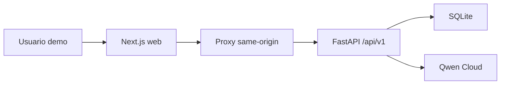

# Arquitectura de experiencia frontend

## Propósito

Definir la experiencia y los límites técnicos de Sprint 3 sin reabrir la
arquitectura backend cerrada en Sprint 2.

Este documento deriva de ADR-002 y ADR-014. No introduce una decisión
arquitectónica alternativa.

## Principios

1. **Workspace antes que chatbot.** La interfaz representa trabajo comercial,
   estado y resultados.
2. **Valor antes que internals.** Los eventos se traducen a lenguaje útil sin
   mostrar JSON crudo.
3. **Contrato antes que conveniencia.** La UI solo muestra datos disponibles en
   `/api/v1`.
4. **Revisión humana visible.** Propuesta y correo son borradores.
5. **Tres superficies.** El sprint no inicia un CRM generalista.
6. **Responsive por composición.** El flujo principal no depende de escritorio.

## Arquitectura de contenedores

El navegador llama únicamente a rutas same-origin de Next.js. El proxy:

- reenvía métodos, query strings, cuerpo y `Idempotency-Key`;
- conserva status codes y envelopes seguros;
- no registra secretos ni cuerpos completos;
- obtiene la URL interna de FastAPI desde configuración del servidor;
- no transforma reglas de negocio.

## Mapa de información

### Cockpit `/`

- CTA de nueva consulta;
- runs recientes;
- estado, empresa, mercado y fecha disponibles;
- enlace al workspace;
- estados vacío, carga y error.

La primera versión puede presentar una sola lista centrada en runs. No necesita
tablas paralelas de inquiries y oportunidades.

### Entrada `/inquiries/new`

- textarea para mensaje;
- acción para cargar UC-001;
- nota visible de datos demo;
- submit único: “Crear consulta y ejecutar agente”;
- estado de envío y recuperación ante error de transporte.

El escenario predefinido contiene únicamente la entrada. Ningún resultado se
hardcodea.

### Workspace `/runs/[runId]`

Se organiza en cuatro zonas:

1. cabecera de estado y control;
2. resumen de consulta y análisis;
3. línea de tiempo de ejecución;
4. resultado comercial revisable.

En móvil las zonas se apilan. En escritorio pueden usar dos columnas, siempre
que el resultado no quede subordinado a la trazabilidad técnica.

## Estado del cliente

No se adopta una librería de estado global en Sprint 3. El estado se divide en:

- datos obtenidos desde la API;
- estado local de formularios;
- cursor de eventos por run;
- claves idempotentes por comando en curso.

Las claves se generan en el cliente para:

- creación de inquiry;
- creación de run;
- retry.

Cada clave permanece estable hasta recibir una respuesta definitiva del
servidor. Una nueva intención del usuario genera una nueva clave.

## Polling

El workspace mantiene:

- detalle actual del run;
- `lastSequence`;
- eventos acumulados sin duplicados.

Política inicial:

- consultar estado al abrir;
- mientras `queued` o `running`, consultar eventos incrementalmente;
- usar `after_sequence=lastSequence`;
- aplicar un intervalo base de 1.5 segundos;
- evitar solapamiento de requests;
- pausar cuando la pestaña no está visible;
- reanudar con el mismo cursor;
- detener al recibir estado terminal;
- obtener resultado una vez terminal.

El intervalo es configuración de implementación, no contrato de dominio. No se
añade long polling, WebSocket ni SSE.

## Modelo de presentación

El frontend puede adaptar nombres y formatos, pero no crear hechos.

| Contrato | Presentación |
|---|---|
| `queued` | En cola |
| `running` | Procesando |
| `needs_review` | Listo para revisión |
| `completed` | Completado |
| `failed` | No se pudo completar |
| `current_step` | Paso actual con label legible |
| `tool_name` | Nombre empresarial de la herramienta |
| `warnings` | Avisos visibles y no destructivos |
| importes en céntimos | EUR con formato local |
| timestamps UTC | fecha/hora local |

El mapping de herramientas es cerrado:

| `tool_name` | Label |
|---|---|
| `search_catalog` | Buscar catálogo |
| `get_product_details` | Consultar producto |
| `check_stock` | Verificar stock |
| `retrieve_customer_history` | Recuperar historial |

Las acciones deterministas posteriores se muestran como pasos de negocio desde
eventos y resultado, no se presentan falsamente como tool calls de Qwen.

## Timeline

La vista principal agrupa eventos por paso. Cada item muestra:

- label legible;
- estado;
- hora;
- resumen seguro disponible;
- herramienta cuando `tool_name` exista.

Los detalles técnicos expandibles pueden mostrar:

- event type;
- sequence;
- error code seguro;
- correlation ID.

Nunca muestran:

- prompts completos;
- cadena de pensamiento;
- argumentos o respuesta completa de tools;
- payload crudo de Qwen;
- secretos;
- stack traces.

## Resultado revisable

El resultado terminal conserva secciones independientes y tolera valores
ausentes:

- análisis;
- recomendación;
- quote;
- propuesta;
- borrador de correo;
- customer;
- oportunidad;
- seguimiento;
- memoria;
- warnings.

Cada sección:

- usa datos presentes en `RunResult`;
- tiene estado vacío explícito;
- no falla si otra sección es parcial;
- identifica artefactos como borrador o `needs_review`.

## Errores y recuperación

### Transporte

Un timeout de red no genera inmediatamente un nuevo comando. El cliente
reutiliza la misma clave idempotente para resolver si el servidor creó el
recurso.

### Dominio

El frontend usa `error.code`, `error.message` y `correlation_id`. No interpreta
stack traces ni crea una política propia de retry.

### Retry

El botón aparece solo cuando `retryable=true`. Al ejecutarlo:

- genera una nueva clave;
- crea un run distinto;
- navega al nuevo workspace;
- muestra vínculo al run original mediante `retry_of_run_id`.

## Accesibilidad y responsive

Mínimos:

- navegación completa por teclado;
- foco visible;
- labels asociados a controles;
- contraste AA para texto y estados;
- estados no comunicados solo por color;
- regiones de estado anunciables;
- layout funcional desde 360 px;
- tablas transformadas en tarjetas o scroll seguro en móvil.

## Contrato backend mínimo

Sprint 3 consume únicamente endpoints existentes. El único delta es permitir
`tool_name` en el payload público de eventos.

No se autoriza:

- endpoint agregador específico para frontend;
- endpoint de reset;
- mutaciones de artefactos;
- schema nuevo para métricas;
- búsqueda o filtrado adicional del backend.

## Decisiones que no requieren ADR

- distribución visual de las tres rutas;
- componentes;
- design tokens;
- intervalo inicial de polling;
- adaptadores de labels;
- organización local de archivos frontend.

## Condición para un ADR nuevo

Crear ADR-015 únicamente si se propone:

- sustituir Next.js;
- conectar el navegador directamente a FastAPI;
- WebSockets o SSE;
- estado global complejo como política de aplicación;
- generación versionada de cliente OpenAPI como política permanente;
- nueva topología de despliegue.
